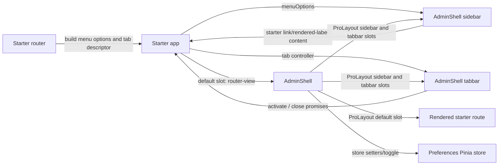

# Design: `AdminShell` with ProLayout, open tabs, and starter-built menu

## Boundary and data flow

`AdminShell` is a frontend-only component in `packages/admin`. It imports `ProLayout` from `pro-naive-ui`, direct `NMenu` from `naive-ui`, and consumes only frontend auth props, starter-built `MenuOption[]`, and an optional complete tab controller. It never imports `vue-router`.

```ts
export type AdminShellTab = {
  key: string;
  label: string;
  closable?: boolean;
};

export type AdminShellTabController = {
  current: AdminShellTab | null;
  activate: (key: string) => Promise<void>;
  close: (closedKey: string, suggestedNextKey: string | null) => Promise<void>;
};

export type AdminShellProps = {
  authStatus: AdminAuthStatus;
  authActions: AdminAuthActions;
  menuOptions?: MenuOption[];
  tabController?: AdminShellTabController;
};
```

`menuOptions` is an opaque Naive UI presentation input. The starter constructs it with the exact visibility, hierarchy, labels, keys, disabled states, and any router-aware link/rendered-label content it needs. `AdminShell` passes it unchanged to `NMenu`; it has no route key, visibility, selection, or activation contract for the menu. The starter owns all router behavior without an admin callback seam.

The starter maps any route it wants represented as an open tab to `tabController.current` and implements tab callbacks with its own router. `AdminShell` owns only its local ordered tab list. Host-reported `current?.key` is the source of truth for active-tab UI; no optimistic tab highlighting occurs after activation.



No route object, router instance, route record, visibility set, backend DTO, session, permission payload, or transport object crosses this boundary.

## Dependency and build boundary

Add `pro-naive-ui` version `^3.2.3` to `packages/admin/package.json` as both a peer dependency and development dependency. Keep its official compatible peers (`vue`, `naive-ui`) as already declared. Add `pro-naive-ui` to library Vite `rollupOptions.external` so consumers resolve the peer.

Do not add `vue-router` anywhere in `packages/admin`: not as a dependency, peer dependency, dev dependency, external, import, runtime type, or test helper.

Sources:

- https://naive-ui.pro-components.cn/zh-CN/os-theme/components/layout
- https://github.com/Zheng-Changfu/pro-naive-ui/tree/master/packages/components/src/layout/demos/zhCN
- https://raw.githubusercontent.com/Zheng-Changfu/pro-naive-ui/master/packages/components/package.json
- https://raw.githubusercontent.com/Zheng-Changfu/pro-naive-ui/master/packages/components/src/layout/props.ts
- https://raw.githubusercontent.com/Zheng-Changfu/pro-naive-ui/master/packages/components/src/layout/slots.ts
- https://raw.githubusercontent.com/tusen-ai/naive-ui/main/src/menu/src/interface.ts
- https://raw.githubusercontent.com/tusen-ai/naive-ui/main/src/menu/src/MenuOption.tsx

## Layout branches and composition

- **Loading:** render an accessible `role="status"`, `aria-busy="true"` region. Clear local tabs. Do not construct `ProLayout`, invoke the default slot, or render menu/tabs. Clearing during loading favors session isolation over retaining tabs across auth restoration.
- **Anonymous:** render `AdminLoginPage` with the original auth state/actions. Clear local tabs. Do not construct `ProLayout`, invoke the default slot, or render menu/tabs.
- **Authenticated:** render a page-height wrapper with a definite `height: 100dvh` (`h-dvh`), not merely `min-height`, containing `ProLayout`. Upstream uses `height: 100%`, so this establishes its percentage-height containing block. Bind `sidebarCollapsed` through `collapsed` / `onUpdate:collapsed`. Use `nav-*` for presentation/preferences, `sidebar` for direct unchanged `NMenu` composition, `tabbar` for internal open tabs, and ProLayout's default slot only for `slots.default?.()`.

`showSidebar` is true when `menuOptions` is non-empty. `showTabbar` is true exactly when `tabController` exists. The shell exposes neither a public sidebar slot nor a public tabbar slot. The header may display only `userLabel`, `subtitle`, and `avatarUrl`; logout remains deferred.

## Sidebar menu

The authenticated branch renders the input by direct composition:

```tsx
<ProLayout showSidebar={Boolean(props.menuOptions?.length)}>
  {props.menuOptions?.length ? (
    <template #sidebar>
      <NMenu options={props.menuOptions} />
    </template>
  ) : null}
</ProLayout>
```

The exact TSX slot syntax follows the existing component pattern, but these invariants are fixed:

- Pass the same `menuOptions` tree and nested option objects to `NMenu`; do not clone, filter, normalize, or add synthetic keys.
- Do not read `MenuOption.key`, `show`, `children`, or selection state in admin code. They are NMenu/starter concerns.
- Do not attach an `onUpdate:value` handler, router callback, or async error/pending state in `AdminShell` for menu selection. `MenuOption.props` is not a menu-item action seam; starter-owned route behavior belongs in link/rendered-label content.
- `AdminShell` does not expose a custom menu type, `AdminNavigation`, visibility/controller prop, filtered-tree helper, or public sidebar slot.

`AdminRouteVisibility` is deleted after a reference sweep because no runtime component needs it. The existing public `AdminMenuTree = MenuOption[]` and `AdminRouteKey = string` aliases remain unchanged; the shell deliberately types its own prop directly as `MenuOption[]` to make the ownership boundary obvious.

## Open-tab lifecycle

1. In the authenticated branch, every non-null `tabController.current` is added to the local ordered list unless its key is already open. Existing entries update presentation fields. `null` opens/highlights nothing.
2. Clicking a tab awaits `tabController.activate(key)` and does not change local highlight. Only a later host current update highlights the tab, keeping it aligned with `<router-view />`.
3. Closing a closable tab computes a suggested next key: adjacent next, otherwise prior, otherwise `null` for the current tab; unchanged current key for an inactive tab. Await `close`; remove only on success. A rejection retains the tab and displays a generic error.
4. Clear local tabs when auth leaves authenticated (including loading), the tab controller is removed, or the component unmounts. A later authenticated/controller session begins solely from its host-reported current tab.

## Runtime controls

Controls remain internal and mutate only `useAdminShellPreferencesStore`:

| UI control | Store read | Store mutation |
| --- | --- | --- |
| Theme mode | `themeMode` | `setThemeMode` |
| Font size | `fontSize` | `setFontSize` |
| Locale | `locale`, `availableLocales` | `setLocale` |
| Sidebar | `sidebarCollapsed` | `setSidebarCollapsed` via ProLayout update |

Locale is disabled with no options. Components do not parse storage, normalize values, persist, apply global theme/provider effects, or derive menu/route data.

## Public surface

Export only these frontend-only symbols:

```ts
export {
  AdminShell,
  type AdminShellProps,
  type AdminShellTab,
  type AdminShellTabController,
} from "./components/admin-shell";
```

`ProLayout` and Naive primitives remain internal. The package exposes no router or admin navigation integration surface.

## Files and rollback

1. `packages/admin/package.json` — peer/dev dependency.
2. `packages/admin/vite.config.ts` — externalize peer.
3. `packages/admin/src/runtime-contract.ts` — remove only `AdminRouteVisibility` after LSP reference verification.
4. `packages/admin/src/components/admin-shell.tsx` — ProLayout composition, direct menu, tabs, and controls.
5. `packages/admin/src/index.ts` — intentional shell types/exports and clean runtime-contract export cutover.
6. `packages/admin/tests/admin-shell.test.ts` — package-local DOM contracts.

The change is additive except for removal of the unused visibility type. It has no persisted-tab/menu migration. Reverting the component/dependency additions restores the prior package behavior; the type removal is safe only after all reference results are empty.
