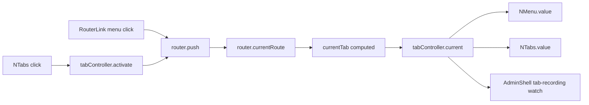
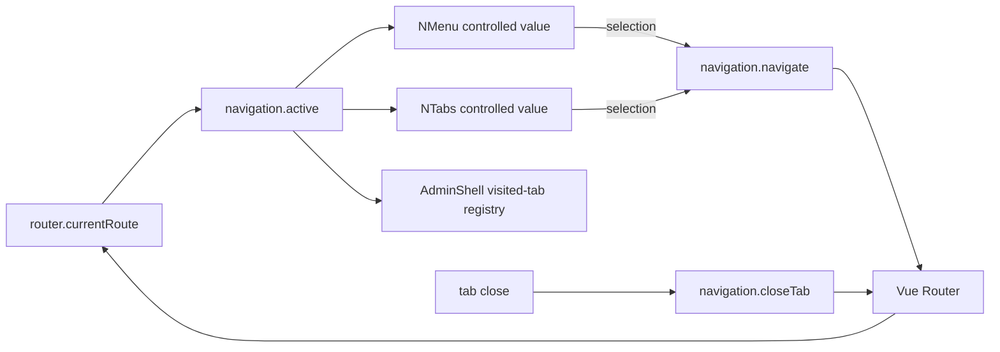
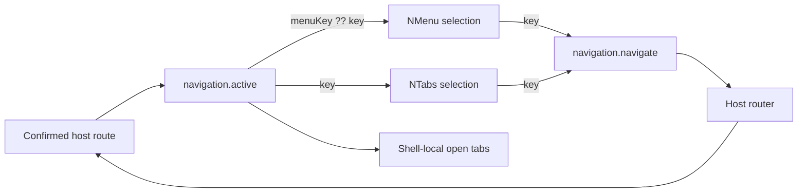
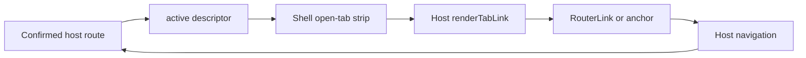

# Design: unified router-neutral shell navigation

## Problem

The route is already authoritative, but its integration is split by control:



The redundant `computed` is small, but it is not the architectural defect. The defect is that `AdminShellTabController` is the shared active-navigation source despite being named and shaped as a tab-only concern, while menu interaction follows a separate callback path.

## Recommended Boundary

Replace the tab-specific host adapter with one router-neutral navigation contract:

```ts
export type AdminShellActiveNavigation = AdminShellTabInput & {
  /** Overrides sidebar selection for hidden/detail routes without changing tab identity. */
  menuKey?: string;
};

export type AdminShellNavigation = {
  active: AdminShellActiveNavigation | null;
  navigate: (key: string) => Promise<void>;
  closeTab: (
    closedKey: string,
    suggestedNextKey: string | null,
  ) => Promise<void>;
};
```

`active` is the sole host-authoritative projection of the confirmed current route. Its `key` controls tab selection and membership; `menuKey ?? key` controls sidebar selection. Keeping both identities in one descriptor supports detail routes that highlight a parent menu item without introducing an independently synchronized active-menu state.

The contract contains navigation-ready frontend state only. It exposes no router instance, route object, backend route, or transport concern.

## Recommended Data Flow



### Demo ownership

The demo continues to own:

- Vue Router and route registration;
- mapping the confirmed current route to one `AdminShellActiveNavigation | null`;
- final `MenuOption[]` hierarchy and labels;
- `navigate` and `closeTab` callbacks.

The stable adapter may expose `active` through a getter that maps `router.currentRoute.value` directly. A separate `currentTab` computed is unnecessary unless another consumer needs the cached projection.

### AdminShell ownership

`AdminShell` continues to own:

- visited/open tab membership;
- visible tab ordering and indexes;
- activation/close pending ownership;
- next-tab suggestion;
- safe user-facing callback failures.

It binds `NMenu.value` to `navigation.active?.menuKey ?? navigation.active?.key` and `NTabs.value` to `navigation.active?.key`. It records `navigation.active` while authenticated. Menu and tab selection call the same `navigation.navigate` callback.

## Shared Invariants Across Candidates

The upstream comparison supports the following constraints regardless of the selected interaction model:

1. The confirmed host route is authoritative. Direct URL entry, browser history, redirects, menu actions, and tab actions all converge through one active descriptor.
2. `active.key` identifies the active tab; optional `active.menuKey` identifies the menu item to highlight for detail/hidden routes. Both are fields of one descriptor, not independently synchronized refs.
3. `AdminShell` alone owns open-tab membership, order, indexes, close fallback, and pending async operations. It stores frontend-ready descriptors, not Vue Router route objects.
4. New-window external destinations do not become active local tabs because they do not change the host route.
5. Iframe-backed content that participates in tabs has a stable internal application route. The application owns the iframe page and source policy.
6. Active UI changes only after authoritative host navigation succeeds. A click may show pending state, but must not optimistically replace the active key.
7. Router-specific matching, destination policy, `RouterLink`, and route metadata remain outside `@noob-naive-ui/admin`.

## Candidate A: Minimal Controlled Navigation Adapter

This is the smallest change and the pattern shared by the inspected frameworks.

```ts
export type AdminShellActiveNavigation = AdminShellTabInput & {
  menuKey?: string;
};

export type AdminShellNavigation = {
  active: AdminShellActiveNavigation | null;
  navigate: (key: string) => Promise<void>;
  closeTab: (
    closedKey: string,
    suggestedNextKey: string | null,
  ) => Promise<void>;
};
```

### Flow



The demo maps `router.currentRoute.value` directly to `active`. `NMenu.onUpdateValue` and `NTabs.onUpdateValue` both call `navigate`. The callback resolves keys and invokes `router.push`; rejected navigation leaves the controlled active value unchanged and lets the shell expose safe feedback.

External menu actions can be represented by app-owned menu labels or by keys whose host callback opens a new window without changing `active`. Iframe-backed items navigate to app-owned internal routes.

### Borrowed ideas

- Controlled menu/tab activation from all seven inspected frameworks.
- Resolved-route-driven tab discovery from Soybean, Vue Naive Admin, Admin Work, and Naive UI Pro.
- Ancestor/override menu identity from Soybean, Jekip, and Naive UI Pro.
- Existing `AdminShell` async failure containment, which is stronger than upstream optimistic active-index patterns.

### Trade-offs

- Smallest public contract and migration.
- Whole menu/tab controls remain consistent click targets.
- No native anchor behavior for internal tabs: middle-click, link context menu, copy-link, or browser open-in-new-tab.
- Destination classification remains application code rather than an explicit reusable model.

## Candidate B: Application Destination-Policy Adapter

This keeps Candidate A's public `AdminShellNavigation` contract but formalizes mixed destination behavior in the demo/starter. It borrows Naive UI Pro's separation between controls and route policy without copying its router plugin system.

```ts
type NavigationDestination =
  | {
      kind: "internal";
      key: string;
      to: string;
    }
  | {
      kind: "external";
      key: string;
      href: string;
      target: "_blank";
    }
  | {
      kind: "iframe";
      key: string;
      to: string;
      src: string;
    };
```

The application maintains a key-to-destination registry. Its adapter implements:

```text
navigate(internal key) → router.push(destination.to)
navigate(external key) → open external browsing context; active route unchanged
navigate(iframe key)   → router.push(destination.to); route page renders iframe src
```

`AdminShell` still sees only `active`, `navigate`, and `closeTab`; it never receives `NavigationDestination`, route metadata, or a router. The iframe route/page remains stable instead of mutating matched route components during a guard, avoiding Naive UI Pro's more complex cleanup mechanism.

### Borrowed ideas

- Naive UI Pro's explicit `newWindow` versus `iframe` destination policy.
- Vue Naive Admin's conversion of embeddable external content into a stable local iframe route.
- Soybean and Admin Work's exclusion of external windows from visited tabs.
- Policy composition at the application boundary rather than polymorphic rendering inside UI controls.

### Trade-offs

- Cleanly supports mixed internal/external/iframe navigation and is straightforward to test without rendering links.
- Keeps the shared package minimal and router-neutral.
- Adds a registry and destination model that are unnecessary if the starter only needs internal routes.
- Programmatic new-window opening still lacks native anchor middle-click/context-menu behavior and may be constrained by popup policies if not invoked synchronously.
- A plugin pipeline like Naive UI Pro's would be over-engineering until multiple independent destination policies require third-party composition.

## Candidate C: Host-Rendered Semantic Navigation Links

Choose this only if native anchor behavior for internal tabs is a required product contract. The host supplies rendered activators, while the shell retains membership and controlled active state.

Because `NTab` installs activation on its outer element, nesting `RouterLink` inside it would create competing click authorities. This candidate therefore replaces the `NTabs` activation surface with a dedicated link-based navigation strip rather than forcing links into `NTab`.

A possible router-neutral rendering seam is:

```ts
export type AdminShellNavigationRenderer = {
  renderTabLink: (
    tab: AdminShellTabInput,
    state: { active: boolean; pending: boolean },
  ) => VNodeChild;
};
```

The application renders `RouterLink` for internal/iframe routes and `<a>` for external destinations. External links remain menu-only and are never passed to the shell's open-tab registry. Iframe tab links target their stable local routes.

The visual strip should use navigation semantics such as `<nav>` and `aria-current="page"`, not claim ARIA `tablist` semantics unless it also implements the full keyboard/focus behavior expected of tabs. Close controls remain separate buttons and must not be nested in anchors.

### Flow



### Borrowed ideas

- App-owned router rendering boundary retained by all upstream architectures.
- External/iframe lifecycle distinction retained from Soybean, Vue Naive Admin, Jekip, and Naive UI Pro.
- Route-authoritative active state retained even though links initiate navigation.

### Trade-offs

- Preserves native link behavior and lets the host choose `RouterLink` versus `<a>`.
- Avoids duplicate `RouterLink` plus `NTab` activation by replacing the activation surface deliberately.
- Expands the public rendering API and makes visual/accessibility contracts more demanding.
- The shell can no longer uniformly await link navigation failures through `navigate`; pending/error behavior needs a separate host signal or router-derived state.
- Reimplements tab-strip interaction and styling currently provided by Naive UI.
- A generic renderer can become a disguised polymorphic `Link` abstraction if it starts owning destination resolution rather than presentation.

## Candidate D: Shared Router Plugin Layer

This is the closest copy of Naive UI Pro: create a router-specific package that owns menu derivation, visited routes, links, iframes, and navigation plugins, then adapt its state into `AdminShell`.

### Benefits

- Strong policy modularity for a large starter ecosystem.
- Route metadata can declaratively configure menu, tabs, external windows, iframe behavior, breadcrumbs, and keep-alive.
- Multiple applications could share one Vue Router integration.

### Costs and risks

- Creates a new router-aware subsystem beyond the reported demo data-flow problem.
- Duplicates responsibilities already owned by the eventual starter/application.
- Encourages full route objects and plugin lifecycle machinery at a boundary currently designed around frontend-ready values.
- Requires cleanup, ordering, conflict, and compatibility contracts for every plugin.
- Naive UI Pro's own implementation demonstrates risks: optimistic active indexes, persisted normalized routes, matched-component mutation, and a local-storage recursion sentinel.

This candidate is not justified for the current task. Revisit only if the project explicitly decides to ship an opinionated Vue Router integration package separate from `@noob-naive-ui/admin`.

## Candidate Decision

| Candidate | Public package complexity | Native links | Mixed destinations | Decision |
|---|---:|---:|---:|---|
| A. Minimal controlled adapter | Low | No | Basic host branching | **Selected for `@noob-naive-ui/admin`** |
| B. App destination-policy adapter | Low; app complexity medium | No | Explicit internal/external/iframe | Deferred to the proper starter template |
| C. Host-rendered semantic links | High | Yes | Explicit through host renderer | Rejected for the admin package |
| D. Shared router plugins | Very high | Policy-dependent | Extensive | Rejected for current scope |

`@noob-naive-ui/admin` will expose only Candidate A with string keys. The demo will use route paths as keys and one controlled `navigate` callback for both menu and tabs. The public package will not add generic complex keys, destination registries, link renderers, router plugins, external-window policy, or iframe policy. A future proper starter template may implement Candidate B behind the same string-keyed adapter without changing the shell contract.

## Upstream Evidence

Seven projects from Awesome Naive UI were inspected at pinned current branch heads: Soybean Admin, Robot Admin, Vue Naive Admin, Admin Work, Dolphin Admin, Naive UI Admin, and Naive UI Pro. All seven use controlled tab callbacks rather than nested `RouterLink` tab labels. The stronger implementations derive selected menu state from the current route and record tab membership from a resolved-route watcher or router completion hook.

Four recurring patterns are worth borrowing:

1. Soybean and Jekip support a route-level active-menu override, while Naive UI Pro derives the deepest matched menu route; this motivates the optional `menuKey` in the single active descriptor.
2. Soybean, Vue Naive Admin, Jekip, and Naive UI Pro keep iframe-backed content in an ordinary local route lifecycle.
3. Soybean, Admin Work, and Naive UI Pro keep new-window external links outside local tab membership.
4. Naive UI Pro separates destination policy from control rendering through route plugins: menu and tabs request navigation normally, while host routing decides internal/new-window/iframe behavior. The equivalent idea belongs in the demo/starter adapter, not the router-neutral admin package.

The comparison also confirms what not to borrow: optimistic active-tab writes before router success, duplicated route/menu/tab active refs, global persisted route-object tab stores, key-encoded external behavior, multiple navigation handlers for one click, and Naive UI Pro's guard-time mutation of matched route components for iframe rendering.

Full comparison and pinned source links: [`research/admin-framework-comparison.md`](./research/admin-framework-comparison.md).

## Compatibility and Migration

This is a clean public-contract cutover within the workspace:

1. Replace `AdminShellTabController` with `AdminShellNavigation` in package exports, props, tests, and the demo.
2. Rename `current` to `active`, `activate` to `navigate`, and `close` to `closeTab`.
3. Route `NMenu.onUpdateValue` and `NTabs.onUpdateValue` through `navigate`.
4. Replace demo `RouterLink` labels with plain labels and controlled menu navigation.
5. Preserve all local tab lifecycle behavior and async session invalidation.

No compatibility shim or deprecated alias is warranted unless there are consumers outside this repository that require a staged migration.

## Validation

Focused package tests must prove:

- direct active-descriptor changes update menu and tab selection and record one tab;
- menu selection and tab selection invoke the same navigation callback;
- rejected navigation retains authoritative selection and exposes safe feedback;
- close success/failure, ordering, concurrent operations, and session invalidation remain unchanged.

The demo must type-check and build against the emitted public declarations. Browser verification must cover menu navigation, tab navigation, direct URL/history navigation, and close behavior without console errors.

## Resolved Decisions

- Candidate A is selected for the admin package and demo.
- Navigation keys remain stable strings; richer destination objects are resolved behind the application callback rather than used as UI keys.
- Native anchor behavior is not part of the admin shell contract.
- External-window, iframe, and other destination policy is deferred to the proper starter template.
