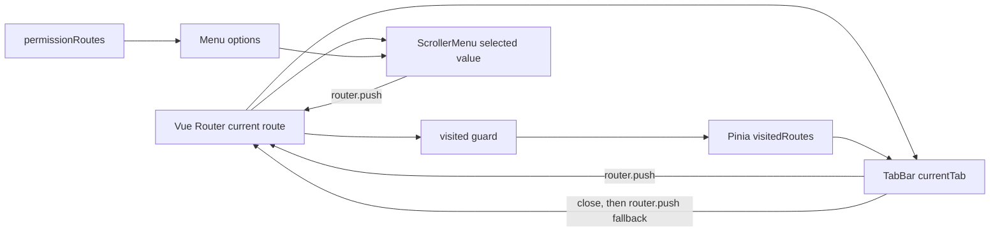

# `qingqingxuan/admin-work` navigation architecture

## Source version

- Repository: <https://github.com/qingqingxuan/admin-work>
- Inspected `master` at commit [`17f6fc1ce0d269f9029d5997a6daa326ffe68fa4`](https://github.com/qingqingxuan/admin-work/commit/17f6fc1ce0d269f9029d5997a6daa326ffe68fa4) (GitHub API returned this as the current `master` head on 2026-07-16).

## Observed data/control flow

### Routes are both navigation source and tab descriptors

1. [`src/router/guard/visited.ts`](https://github.com/qingqingxuan/admin-work/blob/17f6fc1ce0d269f9029d5997a6daa326ffe68fa4/src/router/guard/visited.ts) registers `router.beforeEach`. Except for error/login/redirect/no-tab routes, it adds `to` directly to the visited-route store. On first navigation it also extracts and initializes `meta.affix` routes from `router.getRoutes()`.
2. [`src/store/modules/visited-routes.ts`](https://github.com/qingqingxuan/admin-work/blob/17f6fc1ce0d269f9029d5997a6daa326ffe68fa4/src/store/modules/visited-routes.ts) owns the ordered list, deduplicated by `route.path`, affixed membership, removal, bulk closes, and `localStorage` persistence. It returns the final path after removal/close operations.
3. [`src/router/routes/async.ts`](https://github.com/qingqingxuan/admin-work/blob/17f6fc1ce0d269f9029d5997a6daa326ffe68fa4/src/router/routes/async.ts) shows the descriptor fields reused by this machinery (`path`, `name`, and `meta.title`, `meta.affix`, `meta.cacheable`). The dynamically supplied route equivalent is built in [`src/store/help/index.ts`](https://github.com/qingqingxuan/admin-work/blob/17f6fc1ce0d269f9029d5997a6daa326ffe68fa4/src/store/help/index.ts), `generatorRoutes`.
4. [`src/store/modules/permission.ts`](https://github.com/qingqingxuan/admin-work/blob/17f6fc1ce0d269f9029d5997a6daa326ffe68fa4/src/store/modules/permission.ts) adds the generated routes to Vue Router and exposes the non-hidden subset to the sidebar. [`src/router/guard/permission.ts`](https://github.com/qingqingxuan/admin-work/blob/17f6fc1ce0d269f9029d5997a6daa326ffe68fa4/src/router/guard/permission.ts) ensures those routes are installed before the visited guard operates.

### Menu highlighting is route-controlled; menu selection is a callback

- [`src/components/sidebar/components/ScrollerMenu.vue`](https://github.com/qingqingxuan/admin-work/blob/17f6fc1ce0d269f9029d5997a6daa326ffe68fa4/src/components/sidebar/components/ScrollerMenu.vue) reads `useRoute().fullPath` into `defaultPath`, watches it for browser/direct/programmatic changes, and passes it as `NMenu`'s `value` (and `default-value`). It watches the supplied permission routes to rebuild `MenuOption[]`.
- Its `@update:value` handler `onMenuClick(key)` calls `router.push(key)` only for non-external keys. Thus the menu itself does **not** contain `RouterLink`; component click -> explicit navigation callback -> router -> reactive selected value.
- [`src/components/sidebar/SideBar.vue`](https://github.com/qingqingxuan/admin-work/blob/17f6fc1ce0d269f9029d5997a6daa326ffe68fa4/src/components/sidebar/SideBar.vue) simply supplies `permissionStore.getPermissionSideBar` to `ScrollerMenu`.

### Tabs render buttons and navigate through callbacks; they do not embed links

- [`src/components/tabbar/index.vue`](https://github.com/qingqingxuan/admin-work/blob/17f6fc1ce0d269f9029d5997a6daa326ffe68fa4/src/components/tabbar/index.vue) renders one `NButton` per `getVisitedRoutes`, uses `$route.fullPath` as `currentTab` for visual state, and watches `$route` to keep that state and scrolling current.
- Button and label handlers call `itemClick` -> `handleTabClick` -> `$router.push(path)`. The close icon calls `removeTab`; when the store resolves its fallback path, it calls `$router.push(lastPath)`. Bulk close actions follow the same mutation-then-push pattern. These are controlled callbacks, not native anchors/`RouterLink` labels.
- [`src/components/MainLayout.vue`](https://github.com/qingqingxuan/admin-work/blob/17f6fc1ce0d269f9029d5997a6daa326ffe68fa4/src/components/MainLayout.vue) composes `TabBar`; [`src/components/Main.vue`](https://github.com/qingqingxuan/admin-work/blob/17f6fc1ce0d269f9029d5997a6daa326ffe68fa4/src/components/Main.vue) renders the route outlet keyed by `route.fullPath`.

## Destination classes

### Internal

The ordinary path calls listed above use `router.push`. They pass through the router guard, so the visited-tab guard records the successful route visit and route changes update both menu and tab visuals.

### External

This project has an explicit external branch but not a polymorphic application Link:

- [`src/utils/index.ts`](https://github.com/qingqingxuan/admin-work/blob/17f6fc1ce0d269f9029d5997a6daa326ffe68fa4/src/utils/index.ts), `isExternal`, recognizes only `http:`, `https:`, `mailto:`, and `tel:`.
- [`src/store/help/index.ts`](https://github.com/qingqingxuan/admin-work/blob/17f6fc1ce0d269f9029d5997a6daa326ffe68fa4/src/store/help/index.ts), `transfromMenu`, renders external menu labels as native `<a href=... target="_blank" rel="noopenner noreferrer">`; `ScrollerMenu.onMenuClick` then deliberately does nothing for that key. The fixture [`mock/router/index.js`](https://github.com/qingqingxuan/admin-work/blob/17f6fc1ce0d269f9029d5997a6daa326ffe68fa4/mock/router/index.js) contains `http://www.vueadminwork.com` as an external menu item.
- `generatorRoutes` sets an `outLink` external URL as the route `path`, so no RouterLink abstraction normalizes it. External destinations never enter `visitedRoutes`, hence never produce a tab.

### Iframe

No iframe destination type, iframe renderer, or iframe-specific route metadata was found in the architecture sources inspected above. The external branch opens a new browsing context, not an embedded frame. Therefore this repository is evidence for **external menu-only** destinations, not iframe-tab support.

## Transferable ideas for router-neutral `AdminShell`

1. **Borrow the state direction, not the framework coupling.** Both menu selection and tab active styling derive from one authoritative navigation result (here, Vue Router's current route). For `AdminShell`, let the host expose exactly one active descriptor/identity; render both controlled values from it. A menu or tab action requests navigation through a host callback; only the host's later authoritative update changes active state.
2. **Keep open-tab membership local to the shell.** The visited store proves tab membership has a separate lifecycle from active-route identity, but its global Pinia/router coupling is unsuitable to borrow. `AdminShell` should keep dedupe, ordering, affix/pinning equivalent (if any), close operations, and fallback decision state locally, then invoke host navigation.
3. **Use controlled callbacks, not nested links, for tab activation.** The tab bar's whole clickable item has one handler and the close affordance has its separate handler. This avoids link-click plus tab-click bubbling/duplicate navigation and keeps router APIs outside the reusable component.
4. **Model destinations at the host boundary rather than hide them in a `Link`.** Admin Work's external special case is narrow and bypasses tab membership. A router-neutral shell should not itself interpret router locations or create a polymorphic Link merely to reproduce that. If product requirements add external/iframe tabs, make destination kind an explicit host-supplied descriptor and assign its navigation semantics to the host callback; otherwise retain external links as application-rendered, menu-only labels.
5. **Do not borrow the drift-prone parts.** `TabBar` seeds a local `$route.fullPath` and the menu maintains another local `defaultPath`; `visitedRoutes` is also global/persisted. Those are exactly the competing route projections the target task wants to eliminate. One named host active-navigation value should feed menu and tab selected state directly.
