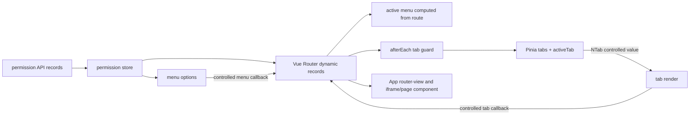

# `zclzone/vue-naive-admin` navigation architecture

## Source version

- Repository: <https://github.com/zclzone/vue-naive-admin>
- The repository's checked-out default branch is `2.x`, at [`cebfc605bdde06505060b3ea8096cdf8c64bffb3`](https://github.com/zclzone/vue-naive-admin/commit/cebfc605bdde06505060b3ea8096cdf8c64bffb3), cloned and inspected on 2026-07-16.
- Every URL below is pinned to that commit rather than a moving branch.

## Route → active menu → tab → rendered page flow

### Dynamic route and menu construction

- [`src/router/guards/permission-guard.js`](https://github.com/zclzone/vue-naive-admin/blob/cebfc605bdde06505060b3ea8096cdf8c64bffb3/src/router/guards/permission-guard.js) fetches permissions, calls `permissionStore.setPermissions`, resolves component modules, then adds `permissionStore.accessRoutes` to Vue Router before retrying the pending navigation.
- [`src/store/modules/permission.js`](https://github.com/zclzone/vue-naive-admin/blob/cebfc605bdde06505060b3ea8096cdf8c64bffb3/src/store/modules/permission.js) derives both `accessRoutes` and `menus` from that one permission record collection. A menu item carries `key: route.name`, `path: route.path`, and `originPath: route.meta.originPath`.
- [`src/router/index.js`](https://github.com/zclzone/vue-naive-admin/blob/cebfc605bdde06505060b3ea8096cdf8c64bffb3/src/router/index.js) creates the router; [`src/router/guards/index.js`](https://github.com/zclzone/vue-naive-admin/blob/cebfc605bdde06505060b3ea8096cdf8c64bffb3/src/router/guards/index.js) registers permission and tab guards.

### Active menu: direct projection of current route

- [`src/layouts/components/SideMenu.vue`](https://github.com/zclzone/vue-naive-admin/blob/cebfc605bdde06505060b3ea8096cdf8c64bffb3/src/layouts/components/SideMenu.vue) computes `activeKey` directly as `route.meta?.parentKey || route.name`, binds it to `NMenu :value`, and watches `route` to call Naive UI's `showOption()` after the update. Thus direct URL entry, browser navigation, menu navigation, and tab navigation all get selected-menu state from the router result.
- Menu clicks are controlled: `@update:value="handleMenuSelect"` calls `router.push(item.path)` for ordinary items. The menu labels are strings; no `RouterLink` is rendered inside an `NMenu` option.

### Open tabs: router guard creates membership; NTab requests navigation

- [`src/router/guards/tab-guard.js`](https://github.com/zclzone/vue-naive-admin/blob/cebfc605bdde06505060b3ea8096cdf8c64bffb3/src/router/guards/tab-guard.js) is an `afterEach` hook. For every non-excluded successful navigation, it maps the resolved route into `{ name, path: fullPath, title, icon, keepAlive }` and calls `tabStore.addTab`.
- [`src/store/modules/tab.js`](https://github.com/zclzone/vue-naive-admin/blob/cebfc605bdde06505060b3ea8096cdf8c64bffb3/src/store/modules/tab.js) owns ordered `tabs`, `activeTab`, reload state, close and bulk-close behavior, and session persistence. `addTab` deduplicates/replaces by `fullPath` and sets active. Removing the active tab pushes the last remaining tab through its injected router store.
- [`src/layouts/components/tab/index.vue`](https://github.com/zclzone/vue-naive-admin/blob/cebfc605bdde06505060b3ea8096cdf8c64bffb3/src/layouts/components/tab/index.vue) binds `NTab` names to `item.path` and `NTabs :value` to `tabStore.activeTab`. A tab's entire activation behavior is an `@click` callback: `tabStore.setActiveTab(path); router.push(path)`. It does **not** embed `RouterLink` or native anchors in tab labels. Close is `NTabs @close -> tabStore.removeTab`.
- [`src/layouts/normal/header/index.vue`](https://github.com/zclzone/vue-naive-admin/blob/cebfc605bdde06505060b3ea8096cdf8c64bffb3/src/layouts/normal/header/index.vue) places `AppTab` in the normal layout header. [`src/App.vue`](https://github.com/zclzone/vue-naive-admin/blob/cebfc605bdde06505060b3ea8096cdf8c64bffb3/src/App.vue) renders the resolved route component inside its selected layout, keys it with `curRoute.fullPath`, and derives KeepAlive names from the same tab store.

## External and iframe behavior

This upstream has a meaningful distinction between a *source external URL* and a *local iframe route*:

1. In `permission.js`, `generateRoute` detects `isExternal(item.path)`, saves the original URL as `meta.originPath`, changes the navigation path to `/iframe/${hyphenate(item.code)}`, and changes the component to `/src/views/iframe/index.vue`. The dynamic record can therefore be selected, tabbed, revisited, and cached as an ordinary internal route.
2. [`src/views/iframe/index.vue`](https://github.com/zclzone/vue-naive-admin/blob/cebfc605bdde06505060b3ea8096cdf8c64bffb3/src/views/iframe/index.vue) is deliberately tiny: it renders `<iframe :src="route.meta.originPath">`.
3. `SideMenu.handleMenuSelect` gives the user two navigation policies for one external menu item: its confirmation's positive action calls `window.open(item.originPath)`; its cancellation calls `router.push(item.path)`, which enters the local iframe route. This is application-level branching, not a polymorphic Link component.
4. [`src/utils/is.js`](https://github.com/zclzone/vue-naive-admin/blob/cebfc605bdde06505060b3ea8096cdf8c64bffb3/src/utils/is.js) provides the `isExternal` predicate used by both the route generation and menu click branches.

## Transferable findings for router-neutral `AdminShell`

1. **Borrow the single-source direction.** `SideMenu` projects its selected value directly from the authoritative route, and tabs are created only after route completion. The app should provide `AdminShell` one active navigation descriptor/identity from its route state; the shell uses it for both selected menu and selected tab rendering.
2. **Borrow controlled actions, not nested links.** Both `NMenu` and `NTabs` use event callbacks that invoke router navigation. This avoids RouterLink/anchor click bubbling through Naive UI's tab activation layer and preserves a router-neutral shell API such as `onNavigate(key)`.
3. **Do not copy its duplicate active state.** `tabStore.activeTab` is written during `afterEach`, but the tab click writes it *before* `router.push`; that produces a temporary pre-navigation projection and couples tab membership to a global router store. The target shell should keep local membership/order but accept host-authoritative active state only after successful route changes.
4. **Classify external versus iframe at the host boundary.** The useful insight is that an iframe is not an external-link rendering detail: it must have a stable local route key and ordinary tab descriptor, while `window.open` is menu-only and has no active tab. A reusable router-neutral shell should receive this resolved destination kind/descriptor and request navigation through the host, rather than importing router APIs or inventing an app-level Link abstraction.
5. **Keep the iframe renderer application-owned.** This upstream's iframe component reads Vue Router `meta.originPath`; an `AdminShell` should not take on this responsibility. The application converts an external URL into its own iframe route/page if it wants tab participation.
