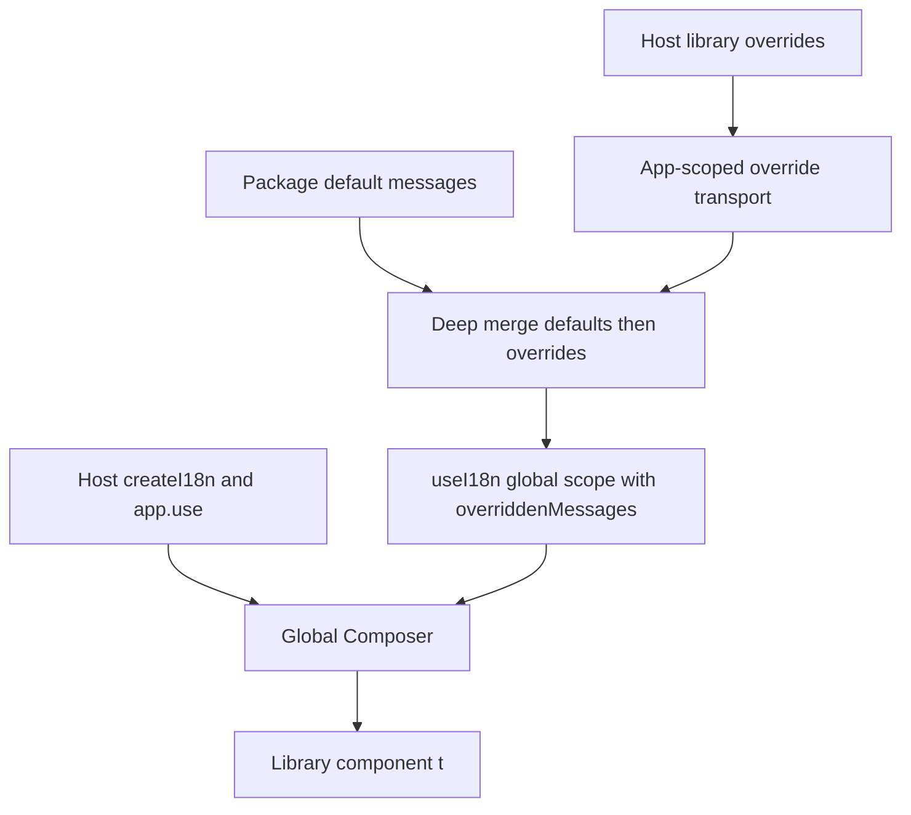
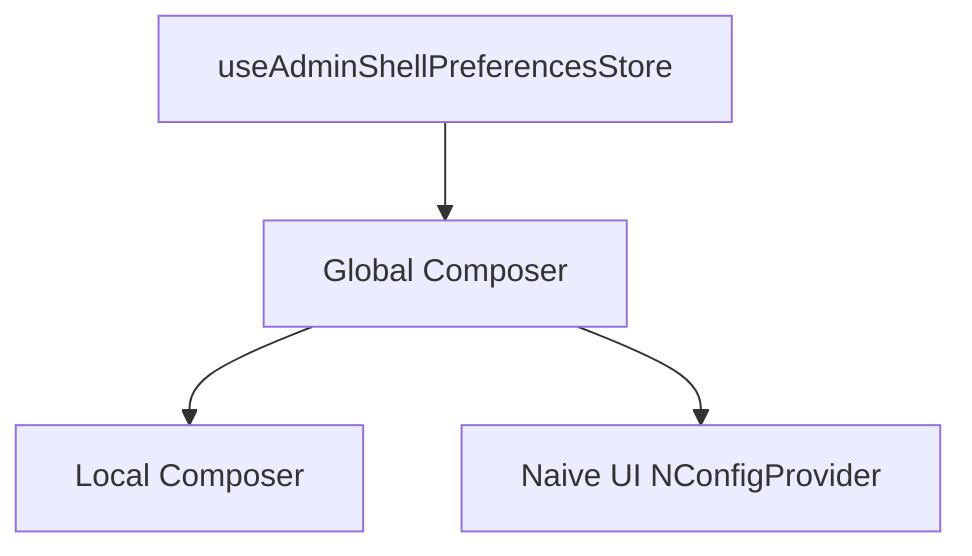

# Candidate design: global Composer with precomposed library overrides

## Architecture under discussion

The host owns the only Vue I18n instance. Component libraries do not create local or fallback Composers.



Each package computes the messages supplied to Vue I18n before component-time registration:

```ts
const overriddenMessages = deepMerge(
  packageDefaultMessages,
  hostProvidedOverrides,
)

const composer = useI18n({
  useScope: "global",
  messages: overriddenMessages,
})
```

The host overrides are deliberately part of `overriddenMessages`; messages configured only through `createI18n({ messages })` cannot be assumed to win because `useI18n` merges its incoming global messages later during component setup.

## Invariants

- Exactly one Composer exists per Vue application or SSR request.
- Effective package message precedence is `package defaults < host-provided library overrides`.
- Host overrides may be partial; deep merge preserves default sibling keys.
- All effective package messages enter the global Composer and follow its locale.
- `ui`, `admin`, and the host contribute to one global message-key schema without package wrapper namespaces. Independently owned duplicate keys are invalid collisions.
- Override state must be scoped to an application/request, never a process-global mutable singleton.

## Override transport A: provider plugin

A shared lightweight plugin stores the host override tree under a typed injection key:

```ts
app.use(noobI18nOverridesPlugin, {
  overrides: {
    en: {
      noob: {
        admin: {
          shell: {
            signOut: "Log out",
          },
        },
      },
    },
  },
})
```

The plugin does not create an i18n instance and does not register defaults. Its only responsibility is application-scoped override transport. Each component library injects the shared global-shape override tree, merges applicable values over package defaults, and supplies the effective messages to global-scope `useI18n`.

### Properties

- Safe application/request isolation through Vue provide/inject.
- One shared override channel covers `ui` and `admin`; independent injection keys and package wrapper namespaces are unnecessary because all messages intentionally inhabit one global schema.
- Zero package-specific registration when no overrides are needed, apart from the host's normal `app.use(i18n)`.
- Hosts that need overrides install one additional provider plugin.

## Override transport B: library registration functions

Libraries expose functions that accept host overrides before component mount. Components later consume the registered values when composing effective messages.

The unresolved boundary is storage ownership. A module-level registry is process-global and therefore unsafe for multiple Vue applications and SSR requests. A safe registration API must associate overrides with an application-local owner such as the Vue app, a dedicated runtime object provided to the app, or a request-local Pinia instance. If it ultimately relies on Vue provide/inject, it is functionally a provider API even if exposed through registration functions.

## Design questions for the next pass

1. Can effective messages be registered once per package per Composer without changing the override contract, avoiding repeated merges in every component setup?
2. What is the smallest app-scoped registration-function API that is not merely a less-obvious provider plugin?
3. Should the shared override plugin/API be owned by `ui`, by a shared existing package boundary, or independently exported from each package while using a common schema?
4. How should late override changes behave after a package has already registered effective messages?
5. What startup authority should govern `AdminShell` preference locale versus the host Composer locale?

## Alternative assessment: Paraglide JS

Paraglide JS is compiler-first: each translation becomes a typed ESM function whose text is fixed at compilation. Its runtime controls locale resolution and switching, but exposes no message registration, merge, replacement, or interception API. Consequently, a library can ship compiled default message functions, but an independent host cannot override individual compiled library messages at runtime through an official Paraglide mechanism.

The official shared-UI guidance offers two patterns:

1. Pass already translated strings from the host as component props. This permits complete host control but abandons built-in zero-boilerplate library text.
2. Compile the UI package separately and forward the host runtime's `getLocale`/`setLocale` through `overwriteGetLocale` and `overwriteSetLocale`. This synchronizes locale selection, not message content; the host still cannot override library translations.

Paraglide's message-format plugin can merge multiple message paths at compile time, with later paths overriding earlier ones. That could work only if the host owns the combined Paraglide compilation and consumes the library's source message files. It does not let a host override already-compiled library output and changes the distribution contract from self-contained component libraries to host-compiled localization sources.

A custom wrapper around every generated message function could consult a runtime override map before falling back to Paraglide output, but that recreates the runtime indirection and override infrastructure this task is designing, while weakening Paraglide's direct-call/tree-shaking advantage. It is not an official workflow.

Current assessment: Paraglide is attractive for application-owned catalogs and typed/tree-shaken message calls, but it does not directly satisfy the task's combination of independently shipped library defaults plus partial host runtime overrides. Full findings and primary-source citations are in `research/paraglide-js.md`.

## Alternative shortlist: Vue-capable runtimes

Exploratory research found two serious alternatives:

- **i18next + i18next-vue** is the strongest direct competitor. Its first-class namespaces isolate package catalogs, and `addResourceBundle(locale, namespace, defaults, true, false)` deeply fills missing package defaults without overwriting existing host values. `createInstance()` supports one runtime per Vue app or SSR request. The main costs are weaker cross-package key typing, runtime catalogs without message-level tree shaking, and an explicit package registration step.
- **fluent-vue + Project Fluent** offers an elegant ordered-bundle fallback chain: place a host partial-override bundle before a package-default bundle so host keys win and missing keys fall through. It has app-scoped provide/inject instances and explicit SSR handling. The costs are adopting FTL, explicit locale bundle-chain management, bundle-local message-reference constraints, and a smaller Vue ecosystem.

Tolgee Vue is technically viable through namespaces and runtime static data, including fully offline use, but its collision precedence requires empirical validation and its localization-platform feature set is heavier than this task requires. Lingui lacks a stable official Vue runtime; typesafe-i18n shares Paraglide's compiler-first runtime-override limitation; Intlayer's Vue-I18n compatibility mode inherits Vue I18n's merge semantics.

The detailed comparison, primary-source citations, and proof-of-concept checks are in `research/vue-i18n-alternatives.md`.

## Candidate architecture: package-local Composers

Each translating component can create a local Composer from package defaults plus package-specific plugin overrides:

```ts
const effectiveMessages = deepMerge(defaultMessages, injectedOverrides)

const local = useI18n({
  useScope: "local",
  inheritLocale: true,
  fallbackRoot: false,
  messages: effectiveMessages,
})
```

Local scopes inherit global locale changes automatically but keep independent message registries. This eliminates `ui`/`admin` key collisions without adding wrapper namespaces. `fallbackRoot: false` prevents missing package keys from implicitly resolving against colliding host-global keys.

Each package can expose an optional override provider plugin with its own injection key. Without that plugin, components use bundled defaults; with it, plugin overrides are precomposed over defaults before local Composer creation. Override precedence is deterministic: `package defaults < package plugin overrides`.

`AdminShell` still needs access to the global Composer when its persisted locale preference controls the application locale. Its local Composer translates shell text; a separate global-scope handle updates the host Composer, which then propagates the locale back to all inheriting local scopes. Neither Composer enters Pinia state.

The principal unresolved cost is Composer granularity. A full package catalog in every component Composer is simple but repeats setup; component-specific message slices reduce work and improve code splitting but expose more override paths; one parent Composer per package subtree is efficient but makes behavior placement-dependent and does not cover standalone UI primitives cleanly.

Full analysis and primary-source links are in `research/vue-i18n-local-scope.md`.

### Refinement: provider carries overrides only

The package plugin should provide only the host's package-level override tree. It should not import defaults or precompose a package-wide effective catalog:

```ts
install(app, options) {
  app.provide(adminOverrideMessagesKey, options?.messages ?? {})
}
```

Each component imports the package's locale catalogs, injects the package override tree, and creates a fresh empty local Composer. It then calls `mergeLocaleMessage()` for every default locale followed by every override locale:

```ts
const overrides = inject(adminOverrideMessagesKey, {})
const composer = useI18n({
  useScope: "local",
  inheritLocale: true,
  fallbackRoot: false,
})

for (const [locale, messages] of Object.entries(defaultMessages)) {
  composer.mergeLocaleMessage(locale, messages)
}

for (const [locale, messages] of Object.entries(overrides)) {
  composer.mergeLocaleMessage(locale, messages)
}
```

This uses Vue I18n's deep incoming merge twice, so overrides win without a custom merge helper. Starting from an empty Composer is important: Vue I18n retains a plain `messages` object passed to `useI18n()` rather than cloning it, so passing imported defaults and later merging overrides can mutate module-level defaults and leak values across component instances, apps, tests, or SSR requests.

Use one locale slice per translating component when package scale makes repeated whole-catalog merging significant. Each component selects only its override slice before the second merge, reducing setup work from repeated package-wide traversal toward the size of that component's own messages.

Provided overrides are immutable startup configuration. Plugin installation must capture an application-scoped readonly snapshot rather than retain behaviorally mutable caller state. Components merge that snapshot once during setup; no watchers, replacement API, removal semantics, or reactive override propagation are exposed.

### Naive UI-inspired locale API

Borrow Naive UI's public contract shape rather than importing its `NLocale` type or `createLocale()` helper. Naive UI derives `NLocale` from its canonical `enUS` object, exposes a component-keyed partial locale mapped type, and implements `createLocale(overrides, fallback)` as a defaults-first deep merge. Its concrete helper is fixed to `NLocale` and uses `lodash-es`, so it is not reusable for Admin messages directly.

The analogous package contract is:

```ts
export interface AdminLocale {
  AdminShell: AdminShellLocale
  AdminLoginPage: AdminLoginPageLocale
}

export type AdminPartialLocale = DeepPartial<AdminLocale>

export interface AdminLocaleOverrides {
  en?: AdminPartialLocale
  "zh-CN"?: AdminPartialLocale
}
```

The component key is configuration routing, not a translation key namespace. `AdminShell` selects `overrides[locale]?.AdminShell`, then merges only that small slice after its defaults into a fresh local Composer. This avoids scanning or merging unrelated component overrides while keeping local translation calls concise, such as `t("signOut")`.

Unlike Naive UI, the package does not need a runtime `createLocale()` deep-merge helper because Vue I18n's two ordered `mergeLocaleMessage()` calls perform defaults-first composition inside the fresh local Composer. A small identity helper such as `defineAdminLocaleOverrides()` may still improve contextual typing without introducing another merge implementation.

Deriving the schema with `typeof enUS` requires a TypeScript/JSON canonical locale whose keys TypeScript can inspect. Plain YAML imports generally expose a broad module type rather than literal key inference, so retaining YAML likely requires explicit component locale interfaces or generated declarations. Choosing inferred TypeScript locale objects versus YAML plus explicit/generated schema is a separate authoring-tooling decision.

### TypeScript locale resources and compilation

If locale resources are authored as TypeScript objects, `@intlify/unplugin-vue-i18n` is not needed to load or type them, and its normal JSON/YAML/SFC resource transformation does not precompile strings embedded in arbitrary TypeScript objects. The workspace build plugin can be removed if no package retains supported external locale resources or SFC `<i18n>` blocks.

The trade-off is runtime message compilation. Plain Vue I18n strings in TypeScript objects are parsed/compiled by the Vue I18n message compiler when used. Keeping precompiled YAML/JSON resources allows the unplugin to emit message functions and permits runtime-only Vue I18n builds that drop the message compiler. TypeScript resources therefore optimize schema inference and tooling simplicity, not necessarily runtime work or final bundle size.

The design must choose between:

1. TypeScript locale objects plus Vue I18n runtime compilation.
2. YAML/JSON resources plus unplugin precompilation and explicit/generated schema typing.
3. TypeScript-authored message functions, which avoid runtime compilation but expose Vue I18n's message-function contract and are less translator-friendly.

Given the local-Composer design, runtime compilation cost should be measured because many component instances can initialize isolated message resources, even though Vue I18n may cache compiled message formats internally.

### Selected resource format and organization

Use JSON locale resources, enable `resolveJsonModule: true` in the relevant package TypeScript configurations, and retain `@intlify/unplugin-vue-i18n` for build-time precompilation. Organize resources component-first:

```text
src/locales/
├── AdminShell/
│   ├── en.json
│   └── zh-CN.json
└── AdminLoginPage/
    ├── en.json
    └── zh-CN.json
```

Component-first organization colocates a component's supported locales, aligns static imports and override-slice ownership, and permits future component-level code splitting. The Vite plugin include patterns must cover these resources in both standalone library builds and source-consuming demo builds.

The prototype must verify that JSON key inference survives package typechecking and source-only declaration emission while Vite transforms the same resources through the i18n plugin. If generated declarations widen JSON imports, explicit exported component locale interfaces remain the fallback without changing runtime resource organization.

### One-way locale synchronization

The runtime locale tree is:



`useAdminShellPreferencesStore.locale` is the sole source of the Admin application locale. After `initialize()` hydrates persisted preferences, AdminShell synchronizes that value to the global Composer. Local component Composers use `inheritLocale: true`, so they follow the global locale automatically. The Naive UI provider receives the Naive locale object selected from the same global locale. There is no reverse Composer-to-store synchronization.


The package plugin exposes the fallback as startup configuration:

```ts
app.use(adminI18nPlugin, {
  fallbackLocale: "en",
  messages: adminOverrides,
})
```

`fallbackLocale` defaults to `"en"`. If the global locale is unavailable in the package resources, the local Composer resolves through this fallback while the global Composer remains on the host-selected locale. AdminShell's Naive UI locale adapter uses the same fallback by default.
Before hydration completes, the synchronization effect must not overwrite restored state with the initial store default. The fallback locale is configurable through the plugin and defaults to `"en"`.

## Prototype verification result — 2026-08-01

`07-31-prototype-i18n-verification` validated the package-local Composer architecture in a private workspace package consumed from demo source:

- defaults, partial immutable overrides, sibling preservation, global-locale inheritance, persisted preference startup, local fallback, and global-message isolation all worked;
- package and demo builds both transformed component-first JSON into precompiled message ASTs;
- unsupported `fr` remained the global locale while the package rendered either configured `zh-CN` fallback or default `en` fallback.

The prototype found two corrections required before production rollout:

1. In Vue I18n 11.4.8, `inheritLocale: true` initializes the local Composer's fallback settings from the root even when local `fallbackLocale` and `fallbackRoot` options are supplied. After creating the local Composer, set `composer.fallbackLocale.value` to the package snapshot and `composer.fallbackRoot = false` before merging messages.
2. `typeof canonicalEnglishJson` works during source typechecking but emits a declaration import to the JSON resource. The current `unplugin-dts` dist-only build does not emit that JSON, so production packages need explicit exported locale interfaces or generated self-contained declarations unless their build intentionally ships matching JSON declaration resources.

These findings keep the selected runtime/resource architecture viable; they narrow the production typing and local-fallback implementation contracts.
