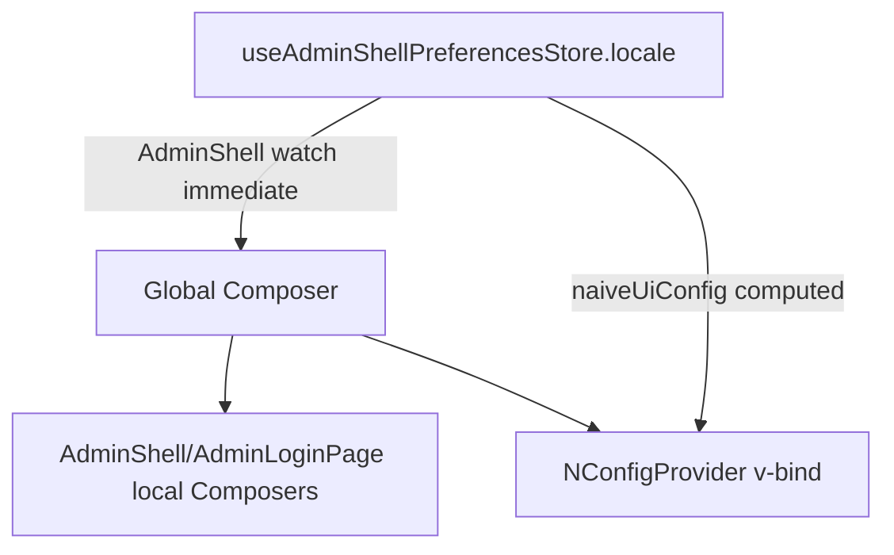

# Design: production i18n scaffolding

Follows the parent design and the shared contract in
`.trellis/spec/ui/frontend/library-i18n-contract.md` (locale-first component
resources, fresh empty local Composers, `fallbackRoot = false` after
creation, immutable override snapshot, host-owned locale/fallback authority,
self-contained public locale interfaces, shared workspace preset).

## 1. Runtime locale ownership (settled this session)



- Store `locale` stays the persisted one-way source. No reverse sync; no
  Composer in serializable Pinia state.
- `AdminShell` synchronizes `preferences.locale` → global Composer in an
  immediate watcher (`useI18n({ useScope: "global" })`). The host no longer
  writes this watcher.
- Host seeds `createI18n({ locale: preferences.locale, fallbackLocale })` at
  startup (after `initialize()`), so the pre-auth login page renders the
  restored locale before `AdminShell` mounts.
- Unsupported locale: global active locale unchanged; local Composers and
  `naiveUiConfig.locale` resolve through the host fallback.

## 2. Admin package

### Shared `I18nText` label type (design revision, supersedes the renderer/resolver drafts)

Tab titles must follow locale switches. The settled contract is a shared
`I18nText` discriminated union in the admin package
(`src/i18n/i18n-text.ts`, exported with its Zod codec and resolver):

```ts
type I18nText =
  | { kind: "string"; value: string }
  | { kind: "i18n"; key: string; named?: Record<string, string | number | boolean> }
```

- `AdminShellTabDescriptor.label: I18nText`; the shell resolves `i18n`-kind
  labels against the host global Composer (`globalComposer.t`) at render
  time, so open AND history-restored tabs re-render in the current locale.
- The navigation adapter persists the label as its I18nText representation
  (`adminI18nTextSchema` in the existing persisted-tab schema — the
  `_noobAdminShell` shape is unchanged), so the message key survives
  refresh and restores render in the current locale. `named` values persist
  with history state and must stay JSON-serializable primitives.
- Gotcha fixed during implementation: tab records live in a reactive map, so
  their label objects are reactive proxies; `structuredClone` in the
  adapter throws `DOMException: Proxy object could not be cloned`.
  `snapshotTab` returns plain-data copies (plain `nav`, plain label with a
  copied `named` record) before navigation requests.
- Navigation failure paths in `AdminShell` log the original error
  (`console.error("activateTab failed:", error)` etc.) before showing the
  localized tab error.

### Resources (locale-first, per contract spec)

```text
packages/admin/src/locales/
├── AdminShell.json       { "en": …, "zh-CN": … }
└── AdminLoginPage.json   { "en": …, "zh-CN": … }
```

Precompiled by the existing shared preset (`packages/*/src/locales/**/*.json`
is already covered). No demo/host Vite changes.

### Public typing — `src/i18n/admin-locale.ts`

Explicit self-contained interfaces (prototype finding #3):

```ts
export type AdminLocaleName = "en" | "zh-CN"
export type AdminComponentId = "AdminShell" | "AdminLoginPage"
export interface AdminShellLocale { … }        // mirrors AdminShell.json
export interface AdminLoginPageLocale { … }    // mirrors AdminLoginPage.json
export interface AdminLocale { AdminShell: AdminShellLocale; AdminLoginPage: AdminLoginPageLocale }
export type AdminLocaleOverrides = Partial<Record<AdminLocaleName, DeepPartial<AdminLocale>>>
```

`DeepPartial` defined locally (mirrors prototype). `tsafe` added as an admin
dependency for `objectEntries` iteration (same pattern as prototype).

### Override plugin — `src/i18n/plugin.ts`

Mirrors `prototype-i18n-verification/src/plugin.ts`:

- `adminI18nPlugin(app, options)` — provides an immutable snapshot
  (defensive deep copy of caller options) under `adminI18nOverridesKey`
  (Symbol injection key). No Composer creation, no fallback configuration.
- `selectComponentOverrides(messages, componentId)` — returns the override
  slice for one component.
- `DEFAULT_SNAPSHOT` frozen empty snapshot.

### Component-local composers

`AdminShell` and `AdminLoginPage` each follow the contract §2 pattern:

```ts
const composer = useI18n({ useScope: "local", inheritLocale: true, fallbackRoot: false })
composer.fallbackRoot = false
for (const [locale, defaults] of objectEntries(componentMessages)) composer.mergeLocaleMessage(locale, defaults)
for (const [locale, slice] of objectEntries(selectComponentOverrides(injected, "AdminShell"))) {
  if (slice !== undefined) composer.mergeLocaleMessage(locale, slice)
}
```

`AdminShell` additionally obtains the global Composer via
`useI18n({ useScope: "global" })` for the locale-sync watcher.

String inventory (all move to resources):

- `AdminShell`: account "Sign out"; font-size labels Small/Medium/Large;
  aria labels `Font size: {label}` / `Language: {label}` / `Account: {user}`;
  tablist aria "Open pages"; tab errors "Unable to navigate." /
  "Unable to close tab."; fallback user label "Signed in".
- `AdminLoginPage`: loading title/description; "Already signed in",
  "Signed in as {user}.", "You are already signed in."; four anonymous
  status messages; form Sign in/Username/Password/Remember me/Signing in….
- `store.loginError` and `userLabel` remain host-supplied values (demo
  localizes its own error text via `i18n.global.t`).

### `naiveUiConfig` — store-owned presentation config

New `src/runtime/naive-ui-config.ts` (mapping functions):

```ts
export type AdminNaiveUiConfig = {
  theme: GlobalTheme | null
  themeOverrides: GlobalThemeOverrides
  locale: NLocale | null          // null → naive-ui default (enUS)
  size: "small" | "medium" | "large"
}
export function resolveAdminNaiveUiLocale(active: string, fallback: string): NLocale | null
// en→enUS, zh-CN→zhCN; unsupported active → map fallback; else null
export const FONT_SIZE_OVERRIDES: Record<AdminFontSize, GlobalThemeOverrides> // 13/14/16px (existing demo behavior)
```

`shell-preferences.ts` additions (all runtime-only, never persisted):

- `systemUsesDark` ref + `setSystemUsesDark(value)` action (host feeds from
  its matchMedia listener; initial value supplied by host call before mount).
- `fallbackLocale` from `initialize({ fallbackLocale?: string })` default
  `"en"` (runtime-only option, same authority the host passes to
  `createI18n`).
- `naiveUiConfig` computed:
  `theme` = dark→`darkTheme`; light→`null`; system→`systemUsesDark ? darkTheme : null`;
  `themeOverrides` = `FONT_SIZE_OVERRIDES[fontSize]`;
  `locale` = `resolveAdminNaiveUiLocale(locale, fallbackLocale)`;
  `size` = `fontSize`.

Store exports the getter; index exports `resolveAdminNaiveUiLocale` and the
`AdminNaiveUiConfig` type for hosts/tests.

## 3. ui package

No translatable text exists (theme bridge only). Scaffolding:

- `src/i18n/plugin.ts` — `uiI18nPlugin` + `uiI18nOverridesKey` +
  `NoobUiComponentId` (empty union today) + override typing, mirroring the
  admin plugin shape so the first component slots in without new
  infrastructure.
- `src/locales/` convention is already covered by the shared preset.

## 4. Demo host

### App-level messages — `apps/demo/src/locales/demo.json`

Locale-first `{ "en": …, "zh-CN": … }`; keys: `nav.*` (menu labels),
`tabs.*` (tab labels, incl. parameterized `Report {id}`), `login.error`,
`pages.<page>.*` (dashboard/reports/settings/internationalization/detail).
Passed straight to `createI18n({ messages: demoMessages })`.

### main.ts

- `preferences.initialize({ defaults: { availableLocales: … }, fallbackLocale: "en" })`
- `createI18n({ legacy: false, locale: preferences.locale, fallbackLocale: "en", messages: demoMessages })`
- Remove the host watch block.
- Menu labels become render functions `() => i18n.global.t("nav.<key>")`
  (MenuOption label already accepts `() => VNodeChild`; reactive across
  locale switches because `t` reads the reactive global locale during render).
- `login()` error text via `i18n.global.t("login.error")`.
- Keep prototype card page and its `PrototypeCard` usage untouched.

### App.tsx

- Keep the matchMedia listener but write into the store:
  `preferences.setSystemUsesDark(systemThemeQuery.matches)` (initial + change).
- Replace theme/font computeds: `<NConfigProvider {...preferences.naiveUiConfig}><RouterView /></NConfigProvider>`.

### routes.ts

- Tab labels are `I18nText` message keys (e.g. `{ kind: "i18n", key: "tabs.dashboard" }`, detail uses `named: { id }`), resolved by the shell against the global Composer — open tabs follow locale switches, and the persisted key keeps restored tabs in the current language.

### Pages

Each page uses `useI18n()` (global scope) + `t("pages.<page>.*")`. The
internationalization page keeps its `data-*` diagnostics and switches its
heading/paragraph text.

## 5. Tests

- `packages/admin/tests/shell-preferences.test.ts` — add `naiveUiConfig`
  boundary: theme per mode incl. system+`setSystemUsesDark`, size mapping,
  locale mapping with fallback (`fr`→`en`; fallback `zh-CN`), no persistence
  of runtime-only fields.
- `admin-shell.test.tsx` / `admin-login-page.test.ts` — update to provide a
  global Vue I18n instance; assert localized text follows composer locale and
  overrides apply; existing behavior assertions preserved.
- Demo: `pnpm --filter demo typecheck` / `build`; browser scenarios below.

## 6. Verification commands

```sh
pnpm install --no-frozen-lockfile   # after adding tsafe to admin
pnpm --filter @noob-naive-ui/admin typecheck
pnpm --filter @noob-naive-ui/admin test
pnpm --filter @noob-naive-ui/admin build
pnpm --filter @noob-naive-ui/ui typecheck && pnpm --filter @noob-naive-ui/ui build
pnpm --filter demo typecheck && pnpm --filter demo build
pnpm exec oxlint --type-aware packages/admin packages/ui apps/demo
pnpm format:check
pnpm exec tsc -b --noEmit && pnpm typecheck
```

Browser scenarios (dev server): defaults en; zh-CN switch updates shell +
login page + naive-ui locale + demo pages + sidebar menu; persisted reload;
`fr` shows en fallback with active locale `fr`; override plugin partial leaf
change; no console/page errors.

## 7. Risks / rollback points

- AdminShell/AdminLoginPage tests currently render without an i18n root —
  may need a shared test i18n harness; failing tests are the gate.
- `vue`/`vue-i18n` dependency placement: keep as today (dependencies) unless
  tests expose a dual-instance issue; do not churn packaging in this task.
- `size: preferences.fontSize` changes component geometry vs the current
  px-only behavior — default "medium" is unchanged; verify visually.
- Tab-label capture-at-open is resolved by `I18nText` message keys; the
  remaining proxy/`structuredClone` gotcha is handled by plain-data
  `snapshotTab` copies.
