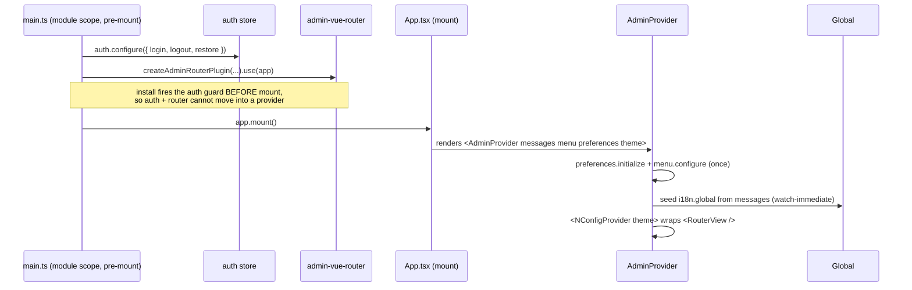

# Design: admin-package `AdminProvider` + provider-seeded demo locale

## Goal

Deliver the converged demo host architecture:

1. An **admin-package `AdminProvider`** component hosts consume — a props-driven, naive-ui-shaped
   root provider that supplies locale (seeds the host global Composer), theme (`NConfigProvider`),
   and mount-safe presentational config (`menu.configure`, `preferences.initialize`).
2. The **demo adopts it**: `main.ts` shrinks to auth + router; `App.tsx` uses `AdminProvider`;
   the spike `LocaleProvider` is replaced.
3. The **regex-based locale HMR injection is removed** from `createWorkspaceLocaleHmrPlugin`
   (already validated); locale HMR relies on component self-accept + `handleHotUpdate` redirect.
4. Docs updated: `library-i18n-contract.md` + stale skill note.

## Architecture

`main.ts` completes all pre-mount config (auth, router) → `app.mount()` → `App.tsx` renders
`AdminProvider` (locale/theme context + mount-safe store config) → `RouterView`.

- `AdminProvider` lives in `packages/admin/src/components/admin-provider.tsx`, exported from
  `packages/admin/src/index.ts`.
- It is a `defineComponent` (self-accepting for HMR) that, in `setup` (ordered — all provider-owned,
  none in `main.ts`):
  1. `preferences.initialize(props.preferences)` (once-guarded) — **not** called in `main.ts`.
  2. `i18n.global.locale.value = preferences.locale` — seeds the active locale for the **pre-auth**
     login page (which renders inside `RouterView`, after this setup). This line moves out of
     `main.ts` with initialize; AdminShell's `useGlobalI18nSync` keeps ongoing store → Composer sync.
  3. `menu.configure(props.menu)` (once-guarded) — **menu is owned by the provider** via a simple
     `menu` prop.
  4. seeds the host global Composer messages from `props.messages` via
     `watch(() => props.messages, seed, { immediate: true })` where
     `seed(m) => for ([locale, msgs] of Object.entries(m)) useI18n({useScope:"global"}).setLocaleMessage(locale, msgs)`,
  5. renders `<NConfigProvider {...preferences.naiveUiConfig} theme={props.theme}>` around the slot.
- Locale/fallback authority stays with the host global Composer; `AdminProvider` only seeds
  messages. `adminI18nPlugin` (package override transport) is unchanged.

### Props contract

| prop | type | effect |
|---|---|---|
| `messages` | `Record<string, Record<string, unknown>>` (host resource, loosely typed) | seed global Composer per locale (watch-immediate) |
| `menu` | `AdminMenuTree` | `menu.configure` |
| `preferences` | `AdminShellPreferencesStoreOptions` | `preferences.initialize` |
| `theme` | optional naive-ui `GlobalThemeOverrides` | merged into `NConfigProvider` |

`messages` is intentionally untyped at the package boundary (the host's message shape is arbitrary);
the admin package seeds whatever the host supplies. `menu`/`preferences` reuse existing admin types.

## Consumption contract (DECIDED 2026-08-12: composable-over-store)

Children retrieve state / call actions through a **`useAdminProvider()` composable** whose state
lives in the Pinia stores as an **implementation detail** — the exact `useAdminShellTabs` /
`useAdminShellTabsStore` pattern.

- `useAdminProvider()` reads `useAdminShellPreferencesStore()` + `useAdminShellMenuStore()`
  internally and exposes a curated surface: read-only `themeMode`/`fontSize`/`locale`/
  `availableLocales`/`naiveUiConfig`/`menu`, plus the actions `setThemeMode`/`setFontSize`/
  `setLocale`/`setSystemUsesDark`/`setSidebarCollapsed`/`toggleSidebar`/`reset`.
- **No provide/inject.** The composable reads the stores directly (needs only an active Pinia), so
  it works anywhere and needs no "single provider" invariant. The `AdminProvider` component remains
  a config/context mount point (props → `preferences.initialize` + `menu.configure` + seed
  `i18n.global`; renders `NConfigProvider`); it does not `provide` the API.
- `App.tsx` switches dark mode via `useAdminProvider().setSystemUsesDark(...)`.

Rationale (mirrors the tabs precedent):
- **SSR**: state is store-backed → per-request Pinia is the established SSR-safe pattern. The
  composable is a projection, so SSR behavior is identical to store-direct.
- **HMR remount safety**: state lives in the stores (survive remounts); the composable owns no
  setup-scope state — the `useAdminShellTabs` footgun is avoided by construction.
- **API curation**: consumers get one typed surface and never touch store internals; the store can
  be reshaped internally without breaking the API.

**Rejected:** (1) raw store-direct (exposes the whole store as API, no curation); (2) provide/inject
context (remount-reset footgun if the provider owns setup state; needs the single-provider
invariant; no SSR benefit over store-backed).

## HMR mechanics (why props + watch, not setup-seed)

- `AdminProvider` cannot import the host resource. The host imports it in `App.tsx` (a component)
  and passes it as `messages`.
- Editing the resource → `handleHotUpdate` redirects to the virtual module → `App` self-accepts →
  re-imports fresh messages → re-renders → `AdminProvider` receives a new `messages` prop
  (new reference) → the `watch` fires → re-seeds the global Composer. No injection, no full reload.
- A setup-only seed would break: on parent (`App`) self-accept, the child `AdminProvider` re-renders
  but its `setup` does not re-run, so the seed would be stale.

## Compatibility / migration

- `createWorkspaceLocaleHmrPlugin.transform` is already simplified to recording-only (validated);
  keep `handleHotUpdate`. The injection code and `COMPOSER_DECL_PATTERN` stay removed.
- Demo: delete `apps/demo/src/locale-provider.tsx`; `App.tsx` imports `demo.json` and passes
  `messages`/`menu`/`preferences`/`theme` to `AdminProvider`; `main.ts` keeps only
  `auth.configure` + `createAdminRouterPlugin` — it loses `preferences.initialize`,
  `menu.configure`, AND the `i18n.global.locale.value = preferences.locale` line (all move into
  `AdminProvider.setup`).
- `library-i18n-contract.md`: add "locale resources are imported and wired inside a component
  (e.g. host `AdminProvider`), not at app setup" convention.
- No change to package components (AdminShell, AdminLoginPage keep `createComponentI18n`).

## Trade-offs

- Props-driven provider makes `AdminProvider` the main host-config entry (mirrors `NConfigProvider`);
  `main.ts` becomes a thin bootstrap (auth + router + `app.use`).
- `preferences.initialize` + `menu.configure` run on every provider setup (HMR remount) but are
  once-guarded, so idempotent.
- `messages` untyped at the package boundary trades type-safety for generality.

## Tests / verification

- Unit: `AdminProvider` seeds the global Composer from `messages` (watch-immediate + on prop change),
  configures menu/preferences once, renders `NConfigProvider`.
- Browser: edit `demo.json` → `hmr update` bounded at the importer (`App`), beforeunload counter 0,
  text updates in place (existing methodology, `noob-demo-browser-verification-setup`).
- Gates: `pnpm --filter admin typecheck`, `pnpm --filter demo typecheck`, demo build, admin + demo
  test suites.
