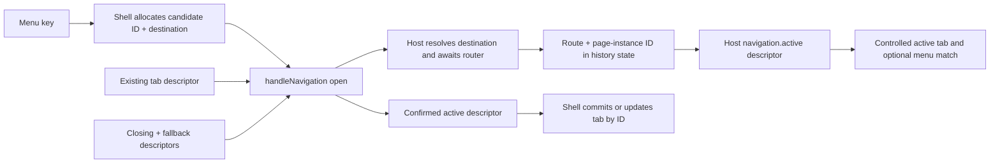

# Design: shell-owned page instances with host-owned routing

## Decision

Use a shell-originated page-instance model. `AdminShell` owns the tab registry; the host owns destination interpretation, router execution, and confirmed active state. Requests cross one discriminated callback and include immutable destination-bearing snapshots, so the host never needs a duplicate tab registry.

## Public model

```ts
/** Selects whether one navigation call opens a page or activates an existing tab. */
export type AdminShellTabNavigationDecision =
  | { kind: "open" }
  | { kind: "activate"; tabId: string };

/** Resolves one navigation call against every currently opened public tab snapshot. */
export type AdminShellTabNavigationResolver = (
  tabs: readonly AdminShellTabDescriptor[],
  destination: AdminShellDestination,
) => AdminShellTabNavigationDecision;

/** Router-neutral destination interpreted only by the host application. */
export type AdminShellDestination = {
  navKey: string;
  params?: Readonly<Record<string, unknown>>;
  resolveTabNavigation?: AdminShellTabNavigationResolver;
};

/** Immutable public snapshot of one opened page instance. */
export type AdminShellTabDescriptor = {
  id: string;
  nav: AdminShellDestination;
  label: string;
  closable?: boolean;
};
/** Mutable shell-local record; never passed to the host. */
export type AdminShellTab = AdminShellTabDescriptor & {
  index: number;
  activationPending: boolean;
  closePending: boolean;
};
```

`id` is the page-instance primary key. `nav` is destination data and is not an identity: several tabs may have equal `navKey` and parameters.

## Navigation requests

```ts
export type AdminShellNavigationRequest =
  | {
      kind: "open";
      candidate: Pick<AdminShellTabDescriptor, "id" | "nav">;
      current: AdminShellTabDescriptor | null;
      closeCurrent: boolean;
    }
  | {
      kind: "activate";
      destination: AdminShellTabDescriptor;
      current: AdminShellTabDescriptor | null;
    }
  | {
      kind: "close";
      closing: AdminShellTabDescriptor;
      destination: AdminShellTabDescriptor | null;
    };

export type AdminShellNavigationResult = {
  /** Confirmed active page, including host-derived presentation, or no active page. */
  active: AdminShellTabDescriptor | null;
};

export type AdminShellNavigation = {
  /** Host-authoritative descriptor derived from route state and history identity. */
  active: AdminShellTabDescriptor | null;

  handleNavigation: (
    request: AdminShellNavigationRequest,
  ) => Promise<AdminShellNavigationResult>;
};
```

Before allocating an open candidate, the shell invokes `destination.resolveTabNavigation` with every opened public tab snapshot in visible order. The resolver may activate any valid tab ID or request a new instance. When absent, the shell activates the most recently opened tab with the same `navKey`; if none exists, it opens a new instance. Resolver output is validated against current membership before any host callback.

After resolution, the host receives only the final `open` or `activate` request. An open request carries the shell-allocated candidate identity and destination; the host returns the confirmed descriptor with route-derived `label` and `closable`. Activate and close requests carry complete snapshots because those tabs already exist. `closeCurrent` remains only on `open`, where it represents replacement navigation.

## Identity allocation

- Shell-originated opens allocate IDs before calling the host but keep candidates outside committed membership.
- Direct URL/bootstrap navigation is the exception: when current history has no page-instance ID, the host allocates one while deriving the initial active descriptor.
- IDs are opaque strings. The implementation may use `crypto.randomUUID()`; tests inject or mock deterministic IDs through the existing environment rather than making ID format contractual.
- Host navigation writes the confirmed ID to browser history state. Redirects preserve it unless they intentionally create a replacement page instance.

## Data flow



## Navigation-trigger and menu behavior

Every navigation call may provide `resolveTabNavigation` on its `AdminShellDestination`. The callback receives all opened descriptors—not a prefiltered subset—so application policy may select any existing tab or force a new instance. The shell passes a readonly visible-order snapshot and validates an `activate` decision's tab ID.

The default resolver scans visible order from newest to oldest and activates the most recently opened tab whose `nav.navKey` equals the requested `navKey`; parameters are deliberately ignored by the default. If no match exists, it opens a new page instance.

Naive UI menu keys remain scalar navigation keys. An ordinary menu click creates `{ navKey: String(key) }` and therefore uses the default resolver. Richer application-owned triggers may attach a call-specific resolver and destination parameters without making `AdminShell` inspect opaque `MenuOption` internals.

The sidebar controlled value is `navigation.active?.nav.navKey` only when that value exists among rendered menu keys. No `menuKey` override exists. Detail pages or repeated instances may therefore have no selected menu item.

## Async ownership

Committed operations capture the exact `AdminShellTab` record:

```ts
const tab = tabs.get(tabId);
if (!tab || tab.closePending) return;

tab.closePending = true;
try {
  await navigation.handleNavigation(request);
  if (tabs.get(tab.id) === tab) {
    // mutate/remove this exact page instance
  }
} finally {
  if (tabs.get(tab.id) === tab) {
    tab.closePending = false;
  }
}
```

This replaces `sessionVersion`, `activationPendingVersion`, and `closePendingVersion` for tab-owned actions. An uncommitted open candidate receives its own pending token/record; stale completion is accepted only while the same navigation adapter and candidate remain current. Candidate invalidation is local and must not become a second global tab identity.

## Host/demo responsibilities

The demo owns:

- Vue Router and route records;
- mapping `AdminShellDestination` into router locations;
- deriving label and closability from the route registry;
- writing and reading page-instance IDs in Vue Router history state;
- deriving the confirmed active descriptor;
- returning confirmed descriptors from `handleNavigation`.

The demo does not own opened-tab membership or ordering.

## Shell responsibilities

`AdminShell` owns:

- candidate and committed page-instance IDs;
- `Map<id, AdminShellTab>` membership;
- visible tab-ID ordering and indexes;
- pending booleans and duplicate suppression;
- current-order close fallback selection;
- committing membership only after confirmed navigation;
- generic UI-safe callback failures.

## Browser history and bootstrap

- `open` pushes or replaces a history entry containing the candidate ID.
- `activate` pushes/replaces according to host router policy while preserving the destination tab ID.
- `close` navigates to the fallback descriptor and persists its ID before shell membership removal.
- Back/forward derives `navigation.active` from route metadata plus the history ID.
- Direct entry or refresh without an ID creates one bootstrap descriptor; refresh with an ID preserves it.
- A history entry whose ID is no longer in shell membership is treated as a confirmed page instance and re-recorded by ID, preserving browser authority.

## Compatibility and migration

This supersedes the earlier `AdminShellTabController` and interim `active`/`navigate`/`closeTab` Candidate A contract. Perform one clean cutover across package exports, shell props, tests, demo, and specs. Remove `menuKey`, route-keyed tab maps, session-version pending ownership, and all aliases.

## Risks

- Browser history state behavior differs from route equality; browser smoke tests are mandatory.
- An open request needs host-derived presentation before membership commit; tests must verify returned metadata and rejected opens.
- Duplicate destinations expose accidental route-key assumptions in close fallback and active rendering.
- Candidate invalidation must prevent stale rejected opens from writing feedback into a replacement auth/navigation session.
