# Admin Authentication Restoration Data Flows

## Purpose

Demonstrate the settled data flow for login, startup restoration, unavailable recovery, logout, host-originated invalidation, operation races, and router readiness.

This document complements [the authentication-restoration grilling notes](./admin-auth-restoration-grilling.md). It describes the settled target architecture. Initial configure-time restoration and router readiness are implemented; tagged causes, unavailable recovery, complete operation generations, local-first logout, and host-invoked invalidation remain sequenced parent-ticket work.

## Ownership

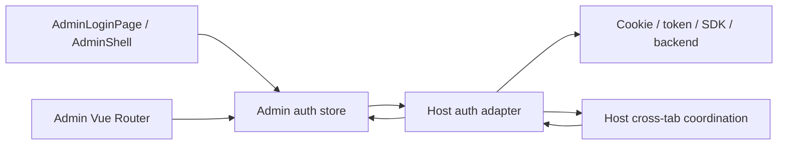
```mermaid
flowchart LR
    UI[AdminLoginPage / AdminShell]
    Auth[Admin auth store]
    Router[Admin Vue Router]
    Host[Host auth adapter]
    Authority[Cookie / token / SDK / backend]
    Coordination[Host cross-tab coordination]

    UI --> Auth
    Router --> Auth
    Auth --> Host
    Host --> Authority
    Host --> Coordination
    Coordination --> Host
    Host --> Auth
```

- Admin owns frontend Authentication state, orchestration, readiness, operation generations, and local transitions.
- The host owns credentials, sessions, persistence, backend/SDK effects, and cross-tab signal delivery.
- Admin Vue Router consumes public Authentication state and readiness. It owns neither authentication authority nor persistence.
- Only a current successful host `login()` or `restore()` result may establish authenticated state.
- Host-originated invalidation may only reduce access.
- Admin stores no presentation identity cache, credential/session material, auth namespace, storage adapter, or cross-tab event record.

## Core contracts

Conceptually:

```ts
type AdminAuthIdentity = {
  userLabel?: string;
  avatarUrl?: string;
  subtitle?: string;
};

type AdminEvictionReason = "expired" | "forbidden" | "unknown";

type AdminAnonymousCause =
  | { kind: "unauthenticated" }
  | { kind: "user-requested" }
  | { kind: "evicted"; evictionReason: AdminEvictionReason };

type AdminAuthRestoreResult =
  | { kind: "authenticated"; identity: AdminAuthIdentity }
  | { kind: "anonymous"; cause: AdminAnonymousCause };

type AdminAuthStatus =
  | { kind: "loading" }
  | { kind: "unavailable" }
  | { kind: "anonymous"; cause: AdminAnonymousCause }
  | ({ kind: "authenticated" } & AdminAuthIdentity);

interface AdminAuthStoreConfig {
  login(values: AdminLoginValues): Promise<AdminAuthIdentity>;
  restore(): Promise<AdminAuthRestoreResult>;
  logout(cause: AdminAnonymousCause): Promise<void> | void;
}
```

Exact declarations remain an implementation decision. The behavioral ownership is settled.

## Login without Remember Me

`remember` is false or omitted. Admin forwards the value; the host decides the actual session policy.

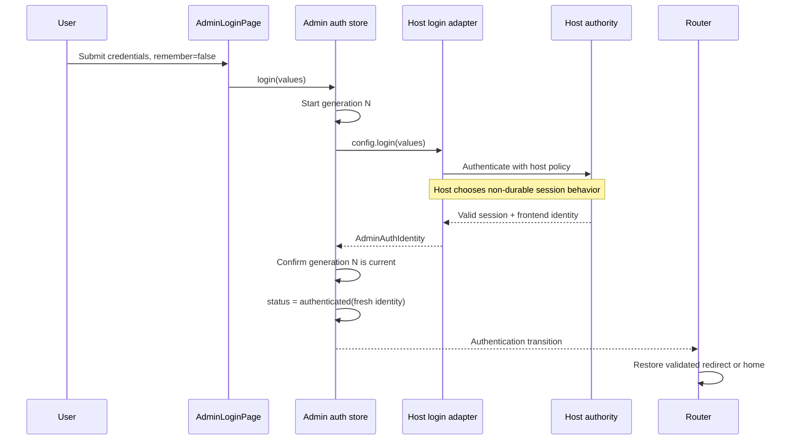
```mermaid
sequenceDiagram
    participant User
    participant Login as AdminLoginPage
    participant Auth as Admin auth store
    participant Host as Host login adapter
    participant Authority as Host authority
    participant Router

    User->>Login: Submit credentials, remember=false
    Login->>Auth: login(values)
    Auth->>Auth: Start generation N
    Auth->>Host: config.login(values)
    Host->>Authority: Authenticate with host policy
    Note over Host,Authority: Host chooses non-durable session behavior
    Authority-->>Host: Valid session + frontend identity
    Host-->>Auth: AdminAuthIdentity
    Auth->>Auth: Confirm generation N is current
    Auth->>Auth: status = authenticated(fresh identity)
    Auth-->>Router: Authentication transition
    Router->>Router: Restore validated redirect or home
```

Result:

- Admin stores no browser record.
- The host decides whether “not remembered” means an in-memory token, session cookie, SDK mode, or another policy.
- Refresh succeeds only when the host mechanism can restore its own current state.

## Login with Remember Me

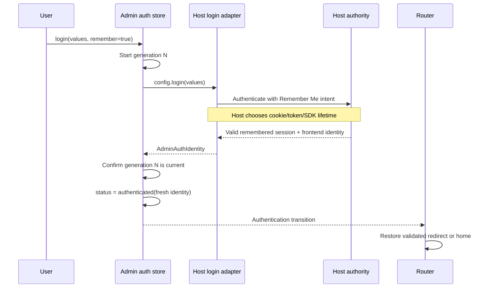
```mermaid
sequenceDiagram
    participant User
    participant Auth as Admin auth store
    participant Host as Host login adapter
    participant Authority as Host authority
    participant Router

    User->>Auth: login(values, remember=true)
    Auth->>Auth: Start generation N
    Auth->>Host: config.login(values)
    Host->>Authority: Authenticate with Remember Me intent
    Note over Host,Authority: Host chooses cookie/token/SDK lifetime
    Authority-->>Host: Valid remembered session + frontend identity
    Host-->>Auth: AdminAuthIdentity
    Auth->>Auth: Confirm generation N is current
    Auth->>Auth: status = authenticated(fresh identity)
    Auth-->>Router: Authentication transition
    Router->>Router: Restore validated redirect or home
```

Admin does not create Remember Me semantics by caching presentation identity. The host is responsible for the lifetime and security of the authority that later allows `restore()` to succeed.

## Startup restoration

Restoration always runs. There is no package cache prerequisite.

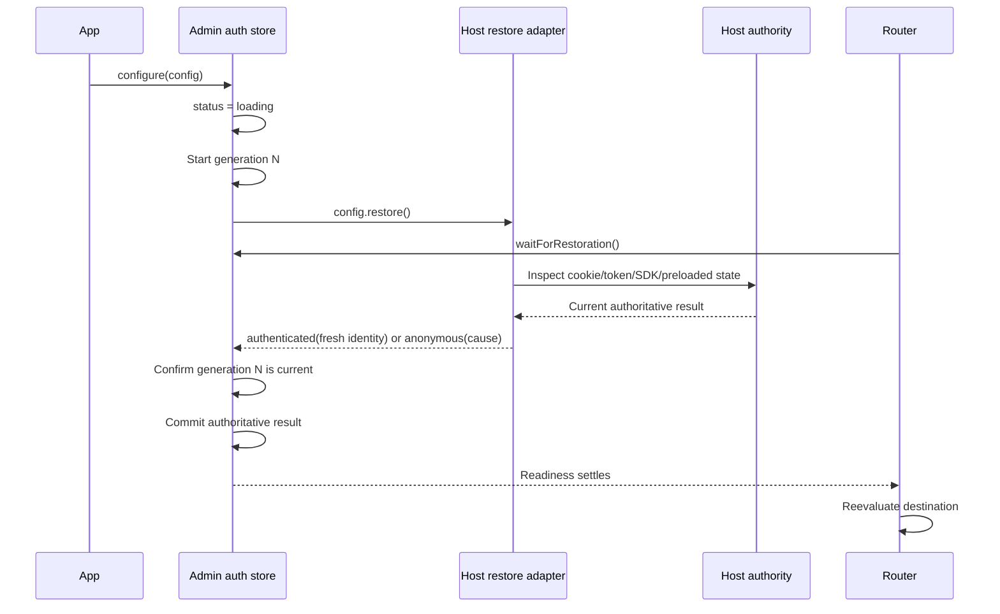
```mermaid
sequenceDiagram
    participant App
    participant Auth as Admin auth store
    participant Host as Host restore adapter
    participant Authority as Host authority
    participant Router

    App->>Auth: configure(config)
    Auth->>Auth: status = loading
    Auth->>Auth: Start generation N
    Auth->>Host: config.restore()
    Router->>Auth: waitForRestoration()
    Host->>Authority: Inspect cookie/token/SDK/preloaded state
    Authority-->>Host: Current authoritative result
    Host-->>Auth: authenticated(fresh identity) or anonymous(cause)
    Auth->>Auth: Confirm generation N is current
    Auth->>Auth: Commit authoritative result
    Auth-->>Router: Readiness settles
    Router->>Router: Reevaluate destination
```

The callback takes no cached identity argument. The host adapter already knows how to locate its own authority. Passing `userLabel`, `avatarUrl`, or `subtitle` could not validate a session.

## HttpOnly-cookie restoration

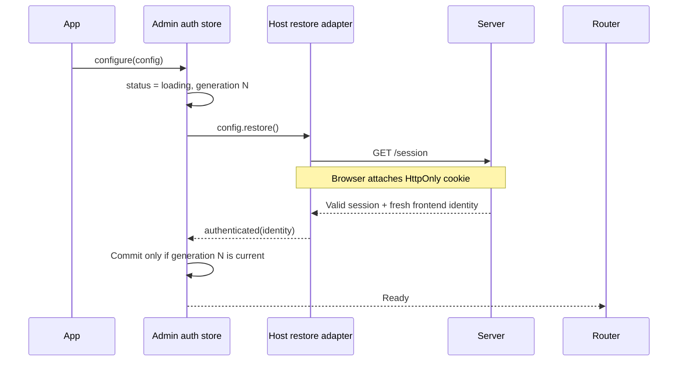
```mermaid
sequenceDiagram
    participant App
    participant Auth as Admin auth store
    participant Host as Host restore adapter
    participant Server
    participant Router

    App->>Auth: configure(config)
    Auth->>Auth: status = loading, generation N
    Auth->>Host: config.restore()
    Host->>Server: GET /session
    Note over Host,Server: Browser attaches HttpOnly cookie
    Server-->>Host: Valid session + fresh frontend identity
    Host-->>Auth: authenticated(identity)
    Auth->>Auth: Commit only if generation N is current
    Auth-->>Router: Ready
```

Admin never reads or duplicates the cookie. Browser storage is not involved.

## Bearer-token or SDK restoration

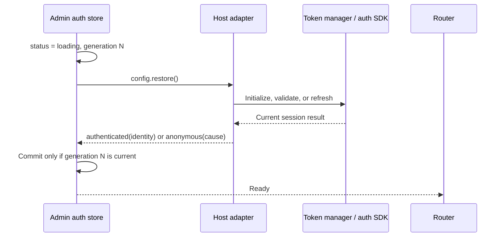
```mermaid
sequenceDiagram
    participant Auth as Admin auth store
    participant Host as Host adapter
    participant Mechanism as Token manager / auth SDK
    participant Router

    Auth->>Auth: status = loading, generation N
    Auth->>Host: config.restore()
    Host->>Mechanism: Initialize, validate, or refresh
    Mechanism-->>Host: Current session result
    Host-->>Auth: authenticated(identity) or anonymous(cause)
    Auth->>Auth: Commit only if generation N is current
    Auth-->>Router: Ready
```

The host owns token storage, SDK persistence mode, refresh rotation, and error classification. Core Admin remains mechanism-neutral.

## Cold start without a valid host session

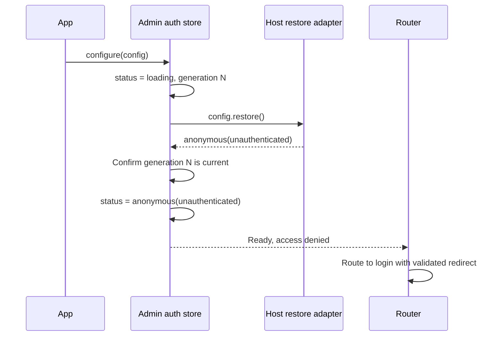
```mermaid
sequenceDiagram
    participant App
    participant Auth as Admin auth store
    participant Host as Host restore adapter
    participant Router

    App->>Auth: configure(config)
    Auth->>Auth: status = loading, generation N
    Auth->>Host: config.restore()
    Host-->>Auth: anonymous(unauthenticated)
    Auth->>Auth: Confirm generation N is current
    Auth->>Auth: status = anonymous(unauthenticated)
    Auth-->>Router: Ready, access denied
    Router->>Router: Route to login with validated redirect
```

Ordinary first-visit anonymity is not eviction and does not show an alarming expiration message.

## Authoritative restoration eviction

The host may determine that a prior session expired or that Admin access is forbidden.

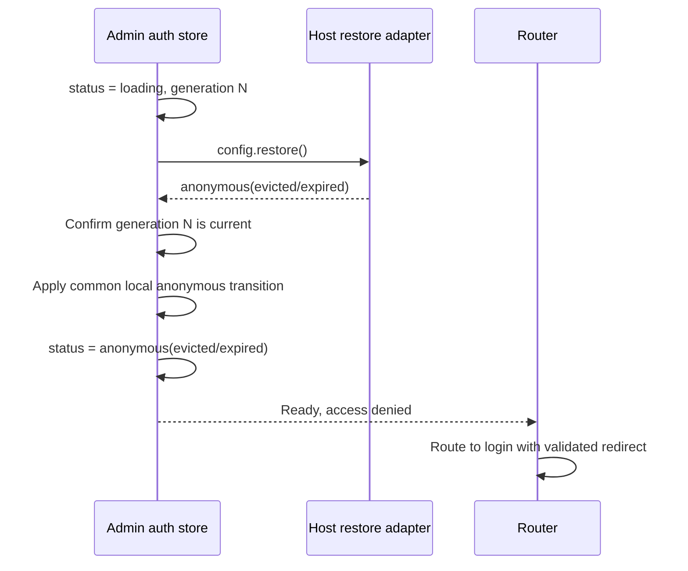
```mermaid
sequenceDiagram
    participant Auth as Admin auth store
    participant Host as Host restore adapter
    participant Router

    Auth->>Auth: status = loading, generation N
    Auth->>Host: config.restore()
    Host-->>Auth: anonymous(evicted/expired)
    Auth->>Auth: Confirm generation N is current
    Auth->>Auth: Apply common local anonymous transition
    Auth->>Auth: status = anonymous(evicted/expired)
    Auth-->>Router: Ready, access denied
    Router->>Router: Route to login with validated redirect
```

An explicit anonymous result is authoritative. No package persistence cleanup exists or is needed.

## Restoration unavailable

A network failure, SDK initialization failure, or timeout does not prove that the host session is invalid.

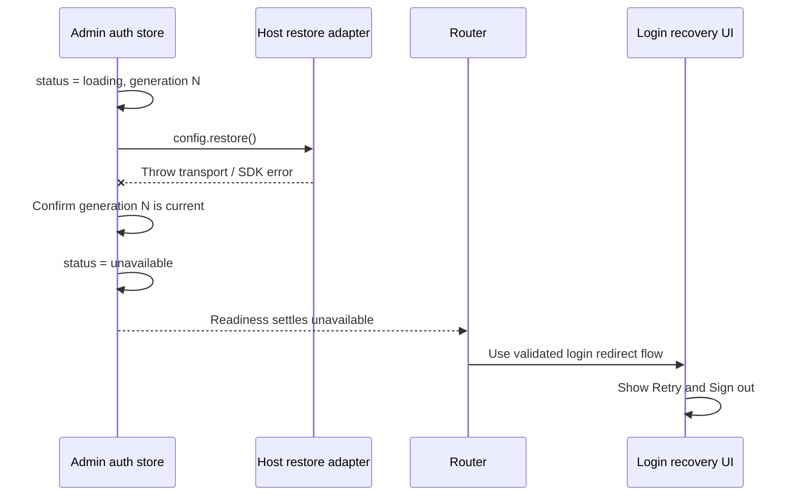
```mermaid
sequenceDiagram
    participant Auth as Admin auth store
    participant Host as Host restore adapter
    participant Router
    participant Login as Login recovery UI

    Auth->>Auth: status = loading, generation N
    Auth->>Host: config.restore()
    Host--xAuth: Throw transport / SDK error
    Auth->>Auth: Confirm generation N is current
    Auth->>Auth: status = unavailable
    Auth-->>Router: Readiness settles unavailable
    Router->>Login: Use validated login redirect flow
    Login->>Login: Show Retry and Sign out
```

Unavailable neither authenticates nor asserts ordinary anonymity. Raw host errors do not enter public state or UI.

## Retry restoration

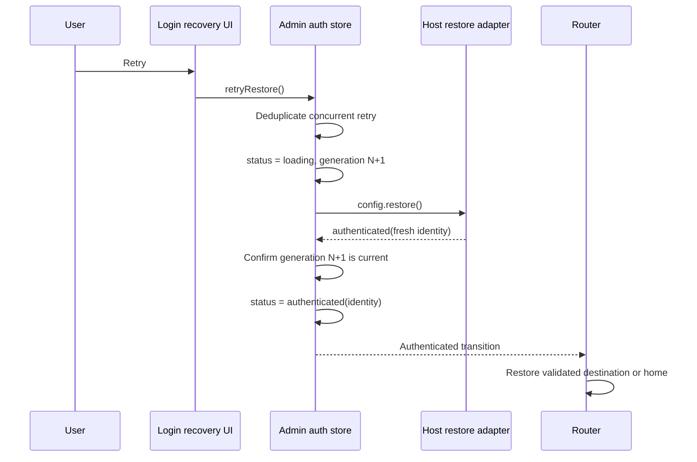
```mermaid
sequenceDiagram
    participant User
    participant Login as Login recovery UI
    participant Auth as Admin auth store
    participant Host as Host restore adapter
    participant Router

    User->>Login: Retry
    Login->>Auth: retryRestore()
    Auth->>Auth: Deduplicate concurrent retry
    Auth->>Auth: status = loading, generation N+1
    Auth->>Host: config.restore()
    Host-->>Auth: authenticated(fresh identity)
    Auth->>Auth: Confirm generation N+1 is current
    Auth->>Auth: status = authenticated(identity)
    Auth-->>Router: Authenticated transition
    Router->>Router: Restore validated destination or home
```

Retry uses the same authoritative host effect. It does not depend on cached presentation identity.

## User-requested logout

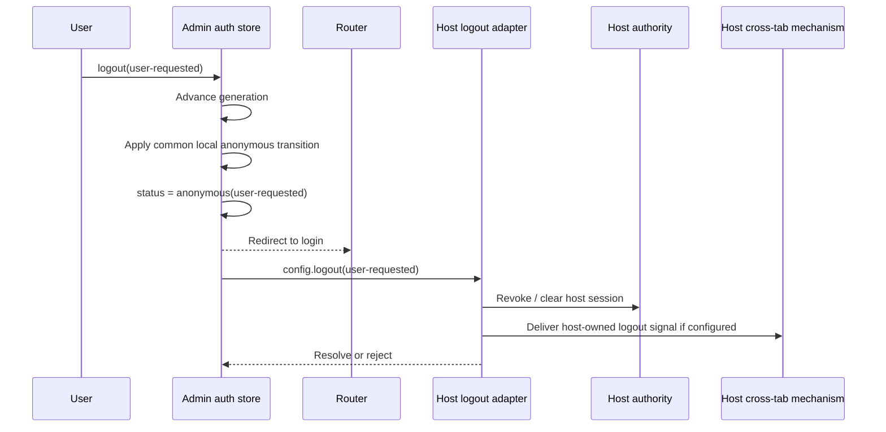
```mermaid
sequenceDiagram
    participant User
    participant Auth as Admin auth store
    participant Router
    participant Host as Host logout adapter
    participant Authority as Host authority
    participant Tabs as Host cross-tab mechanism

    User->>Auth: logout(user-requested)
    Auth->>Auth: Advance generation
    Auth->>Auth: Apply common local anonymous transition
    Auth->>Auth: status = anonymous(user-requested)
    Auth-->>Router: Redirect to login
    Auth->>Host: config.logout(user-requested)
    Host->>Authority: Revoke / clear host session
    Host->>Tabs: Deliver host-owned logout signal if configured
    Host-->>Auth: Resolve or reject
```

Local access closes before host cleanup. Callback rejection remains observable to the initiating caller but never restores authenticated UI.

The host decides when to notify other tabs relative to its cleanup semantics. Admin does not impose a universal transport ordering on cookies, tokens, or SDKs.

## Direct host eviction in one tab

A host API layer may discover expiration or forbidden access during an application request.

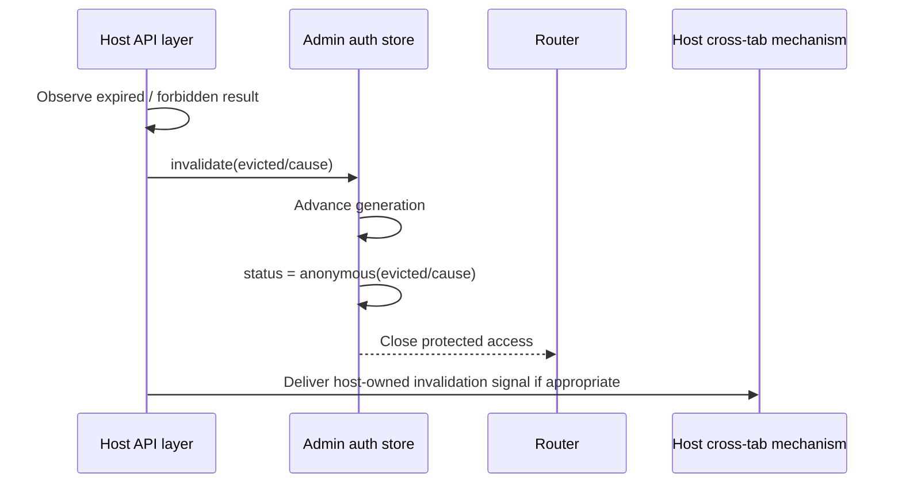
```mermaid
sequenceDiagram
    participant API as Host API layer
    participant Auth as Admin auth store
    participant Router
    participant Tabs as Host cross-tab mechanism

    API->>API: Observe expired / forbidden result
    API->>Auth: invalidate(evicted/cause)
    Auth->>Auth: Advance generation
    Auth->>Auth: status = anonymous(evicted/cause)
    Auth-->>Router: Close protected access
    API->>Tabs: Deliver host-owned invalidation signal if appropriate
```

Whether the host also revokes a broader session is host policy. A forbidden Admin eviction may intentionally leave the broader host session valid.

## Host-originated cross-tab invalidation

Assume Tab A has already produced a host-owned logout or eviction signal. Delivery format is outside Admin.

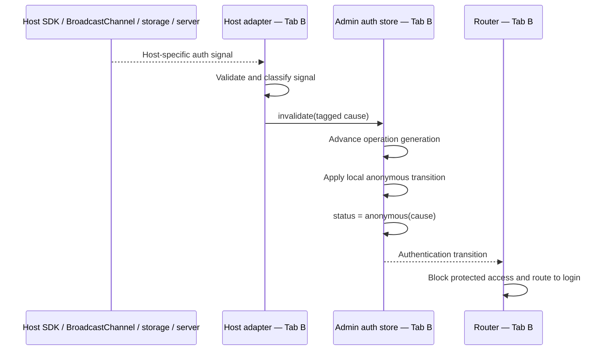
```mermaid
sequenceDiagram
    participant Transport as Host SDK / BroadcastChannel / storage / server
    participant HostB as Host adapter — Tab B
    participant AuthB as Admin auth store — Tab B
    participant RouterB as Router — Tab B

    Transport-->>HostB: Host-specific auth signal
    HostB->>HostB: Validate and classify signal
    HostB->>AuthB: invalidate(tagged cause)
    AuthB->>AuthB: Advance operation generation
    AuthB->>AuthB: Apply local anonymous transition
    AuthB->>AuthB: status = anonymous(cause)
    AuthB-->>RouterB: Authentication transition
    RouterB->>RouterB: Block protected access and route to login
```

Admin's invalidation action:

- invokes no host logout callback;
- emits no cross-tab event;
- owns no namespace, key, schema, listener, or deduplication set;
- does not rerun restoration;
- is safe when repeated;
- allows a later different cause to become the current frontend explanation.

## Why passive invalidation does not restore

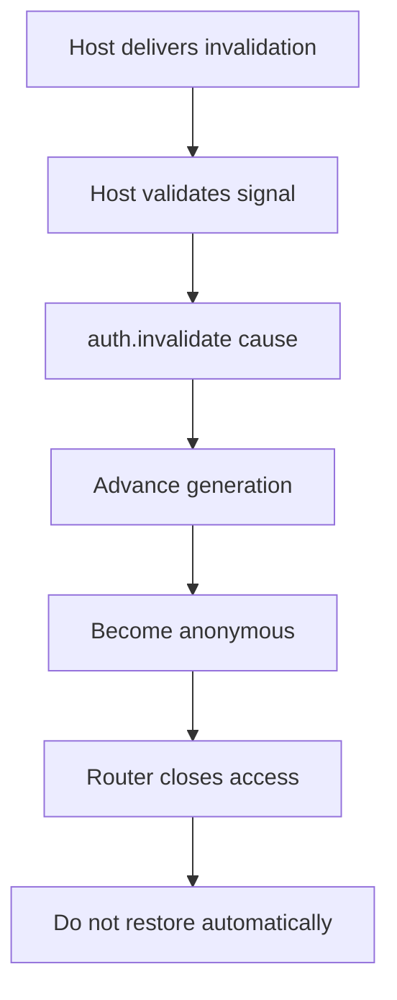
```mermaid
flowchart TD
    A[Host delivers invalidation] --> B[Host validates signal]
    B --> C[auth.invalidate cause]
    C --> D[Advance generation]
    D --> E[Become anonymous]
    E --> F[Router closes access]
    F --> G[Do not restore automatically]
```

Automatic restoration is unsafe as an eviction response:

- It can race initiating logout before cookie or SDK cleanup completes.
- A forbidden Admin eviction may coexist with a valid broader host session.
- It duplicates token refresh, SDK initialization, backend calls, and telemetry across tabs.
- The host already supplied an authoritative signal that access must be reduced.

A later explicit login or application-controlled recovery may establish authentication again through a fresh host effect.

## Pending restoration in a receiving tab

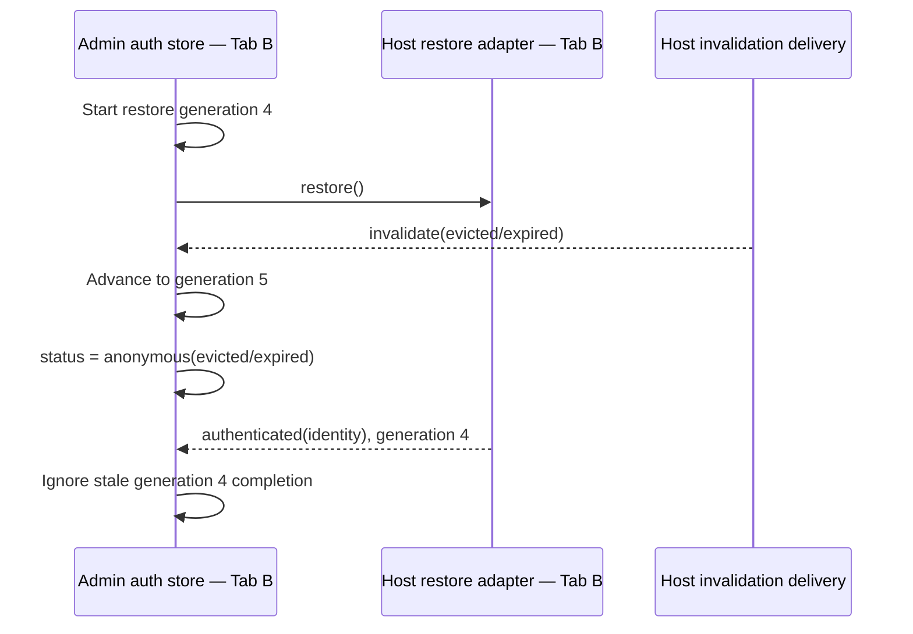
```mermaid
sequenceDiagram
    participant AuthB as Admin auth store — Tab B
    participant HostB as Host restore adapter — Tab B
    participant Signal as Host invalidation delivery

    AuthB->>AuthB: Start restore generation 4
    AuthB->>HostB: restore()
    Signal-->>AuthB: invalidate(evicted/expired)
    AuthB->>AuthB: Advance to generation 5
    AuthB->>AuthB: status = anonymous(evicted/expired)
    HostB-->>AuthB: authenticated(identity), generation 4
    AuthB->>AuthB: Ignore stale generation 4 completion
```

Generation ownership—not transport deduplication—is the Admin invariant that prevents stale reauthentication.

## Logout while restoration is pending

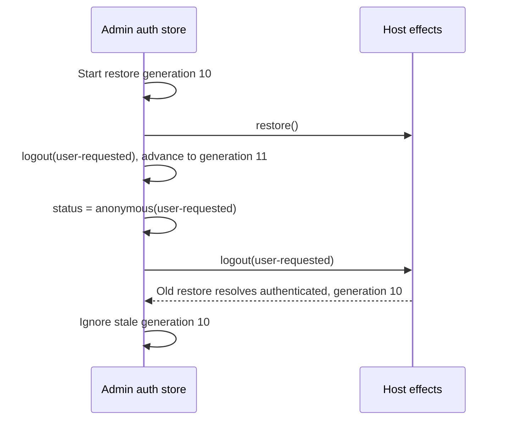
```mermaid
sequenceDiagram
    participant Auth as Admin auth store
    participant Host as Host effects

    Auth->>Auth: Start restore generation 10
    Auth->>Host: restore()
    Auth->>Auth: logout(user-requested), advance to generation 11
    Auth->>Auth: status = anonymous(user-requested)
    Auth->>Host: logout(user-requested)
    Host-->>Auth: Old restore resolves authenticated, generation 10
    Auth->>Auth: Ignore stale generation 10
```

The same latest-generation rule applies to login, restore, retry, logout, direct host eviction, and host-invoked local invalidation.

## Repeated host invalidation

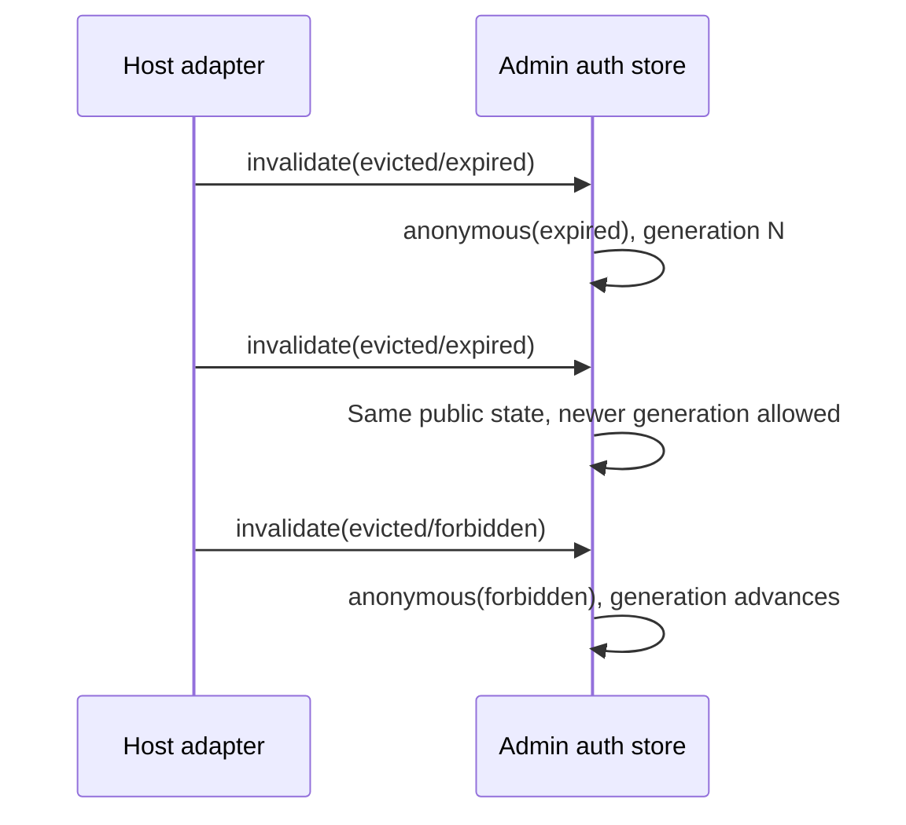
```mermaid
sequenceDiagram
    participant Host as Host adapter
    participant Auth as Admin auth store

    Host->>Auth: invalidate(evicted/expired)
    Auth->>Auth: anonymous(expired), generation N
    Host->>Auth: invalidate(evicted/expired)
    Auth->>Auth: Same public state, newer generation allowed
    Host->>Auth: invalidate(evicted/forbidden)
    Auth->>Auth: anonymous(forbidden), generation advances
```

The host owns transport deduplication when it matters. Admin guarantees safe local reduction even when delivery is repeated or reordered. The latest supplied cause is the current frontend explanation.

## Router readiness

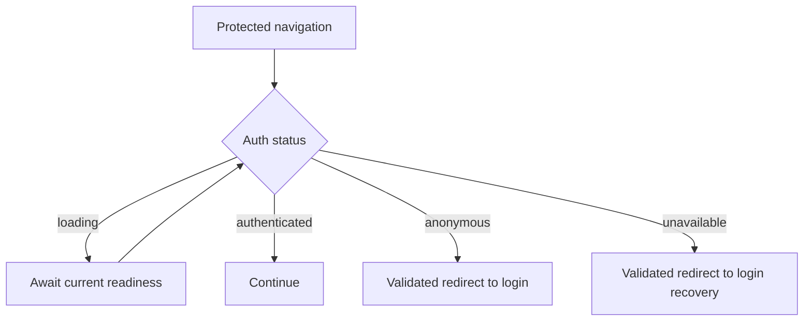
```mermaid
flowchart TD
    A[Protected navigation] --> B{Auth status}
    B -- loading --> C[Await current readiness]
    C --> B
    B -- authenticated --> D[Continue]
    B -- anonymous --> E[Validated redirect to login]
    B -- unavailable --> F[Validated redirect to login recovery]
```

When a newer generation invalidates pending restoration, readiness replacement must settle existing waiters. No guard may wait forever on an abandoned operation.

## State transitions

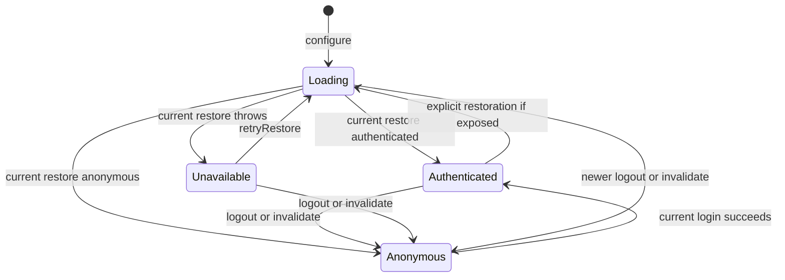
```mermaid
stateDiagram-v2
    [*] --> Loading: configure
    Loading --> Authenticated: current restore authenticated
    Loading --> Anonymous: current restore anonymous
    Loading --> Unavailable: current restore throws

    Anonymous --> Authenticated: current login succeeds
    Authenticated --> Anonymous: logout or invalidate
    Unavailable --> Loading: retryRestore
    Unavailable --> Anonymous: logout or invalidate

    Loading --> Anonymous: newer logout or invalidate
    Authenticated --> Loading: explicit restoration if exposed
```

## Package and host responsibilities by concern

| Concern | Admin | Host |
| --- | --- | --- |
| Frontend auth state | Owns | Supplies outcomes |
| Protected-route readiness | Owns with router adapter | Does not route |
| Presentation identity | Holds fresh current result in memory | Produces it |
| Credential/session persistence | Does not own | Owns |
| Remember Me policy | Forwards user intent | Owns semantics |
| Login/restore/logout effects | Orchestrates | Implements |
| Operation generations | Owns | Does not manage package internals |
| Local invalidation transition | Owns | Invokes when appropriate |
| Cross-tab detection/validation | Does not own | Owns |
| Cross-tab transport/deduplication | Does not own | Owns |
| Positive authentication | Commits current host result | Sole authority |

## Invariants

> Only a current successful host login or restoration may establish authenticated state.

> Host persistence and transport are opaque to Admin; opacity does not permit credential material to cross into Admin storage or state.

> Host-originated invalidation may reduce access, advance operation ownership, and carry a typed frontend cause. It may never authenticate, invoke host cleanup recursively, or broadcast from Admin.

> Admin Vue Router consumes readiness and state. It never owns credentials, session persistence, or cross-tab auth coordination.
