# Admin Authentication Restoration Data Flows

## Purpose

This document demonstrates the planned data flow for login, restoration, logout, eviction, recovery, and cross-tab coordination. It complements [the authentication-restoration grilling notes](./admin-auth-restoration-grilling.md).

The design is not yet implemented.

## Ownership boundary

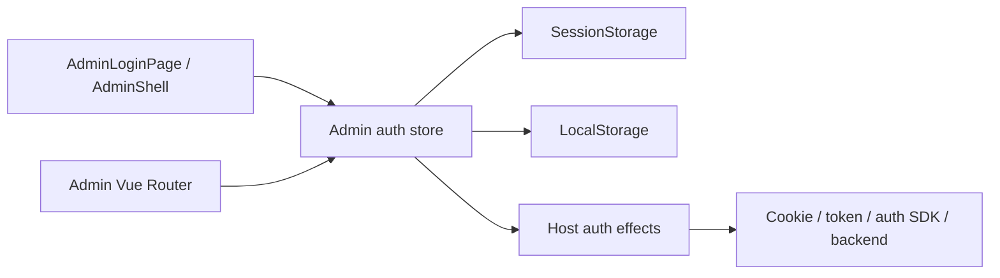

- The host owns credentials, backend sessions, authentication SDK state, and login/restore/logout effects.
- The Admin package stores only presentation identity: `userLabel`, `avatarUrl`, and `subtitle`.
- Browser storage never establishes authentication. Only a current successful host `login()` or `restore()` result may transition to `authenticated`.
- Every auth operation captures a monotonically increasing generation. Only the latest generation may commit state.

## Authentication states and causes

```ts
type AdminEvictionReason = "expired" | "forbidden" | "unknown";

type AdminAnonymousCause =
  | { kind: "unauthenticated" }
  | { kind: "user-requested" }
  | { kind: "evicted"; evictionReason: AdminEvictionReason };

type AdminAuthStatus =
  | { kind: "loading" }
  | { kind: "unavailable" }
  | { kind: "anonymous"; cause: AdminAnonymousCause }
  | ({ kind: "authenticated" } & AdminAuthIdentity);
```

The types illustrate the settled model; exact exported declarations remain an implementation decision.

## Persistence records

The host supplies a stable namespace such as `acme-admin:auth`. The package owns versioned records beneath it.

```text
LocalStorage
├── acme-admin:auth:identity
│   └── { version, identity }
└── acme-admin:auth:event
    └── { version, id, kind: "logout", cause }

SessionStorage
└── acme-admin:auth:identity
    └── { version, identity }
```

Identity and coordination events are separate because removing an identity cannot reliably communicate an eviction cause or repeated logout.

## Login without Remember Me

`remember` is false or omitted.

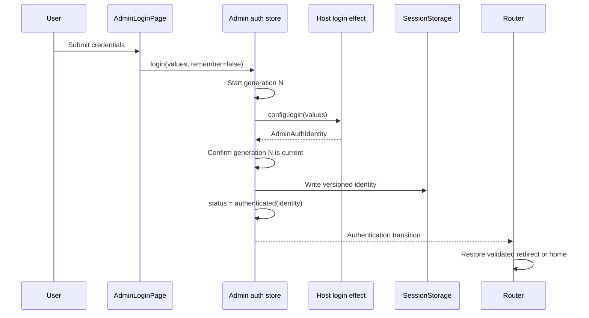

Result:

- Presentation identity is tab-scoped in SessionStorage.
- Refresh in the same tab preserves the cache, but still requires host restoration.
- Another tab does not receive this identity.
- A host credential such as an HttpOnly cookie may nevertheless allow another tab to restore independently.

## Login with Remember Me

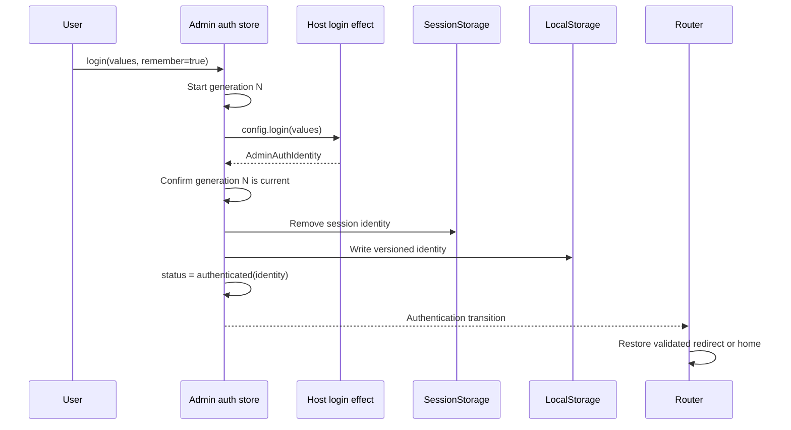

The LocalStorage identity survives browser restarts and is visible to same-origin tabs. Its presence still does not authenticate any tab; every tab calls host restoration.

## Refresh with SessionStorage identity

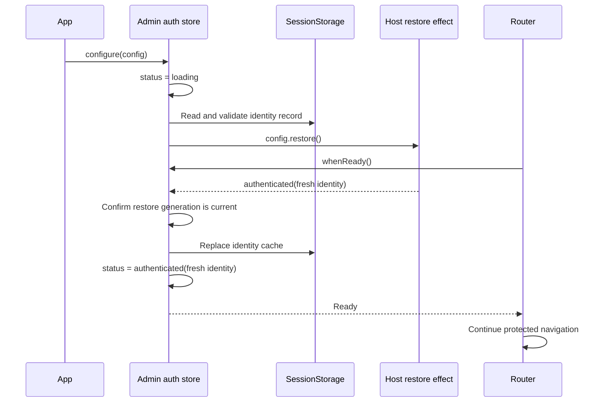

The cache preserves presentation data and the session persistence tier. It does not bypass validation.

## Refresh with LocalStorage identity

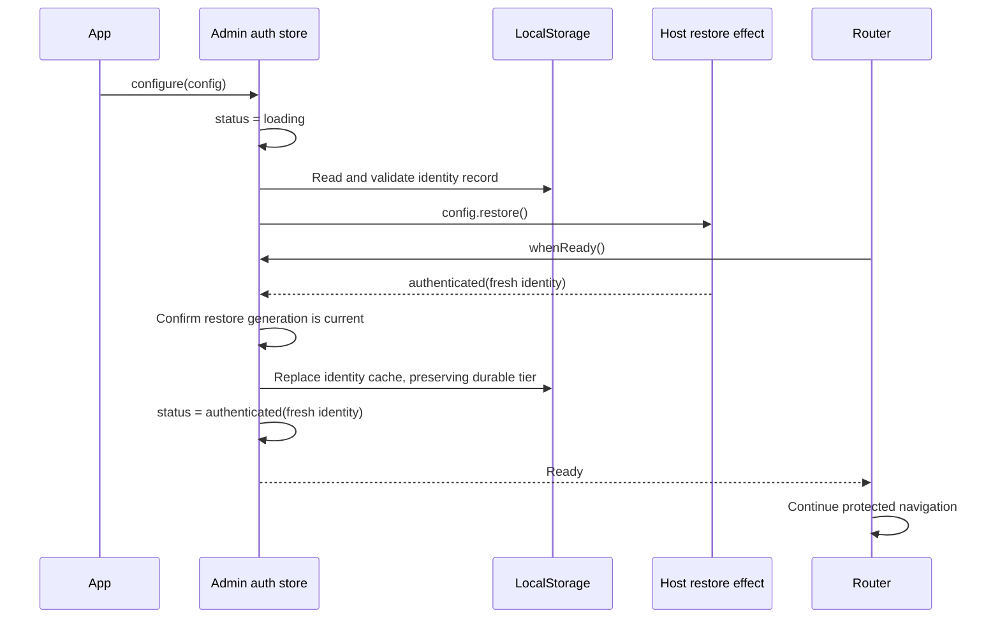

SessionStorage and LocalStorage restoration differ only in cache lifetime. Host validation remains authoritative in both cases.

## Cold restoration through an HttpOnly cookie

Restoration runs even when no identity is cached because JavaScript cannot inspect an HttpOnly session cookie.

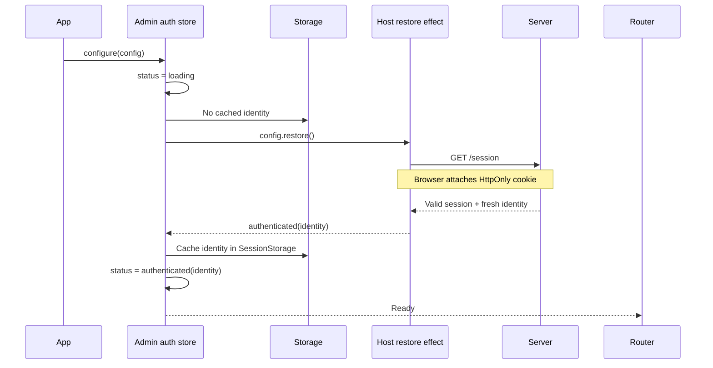

A missing package cache means only that no presentation identity is cached. It does not prove that the host session is absent.

## Cold start without a valid host session

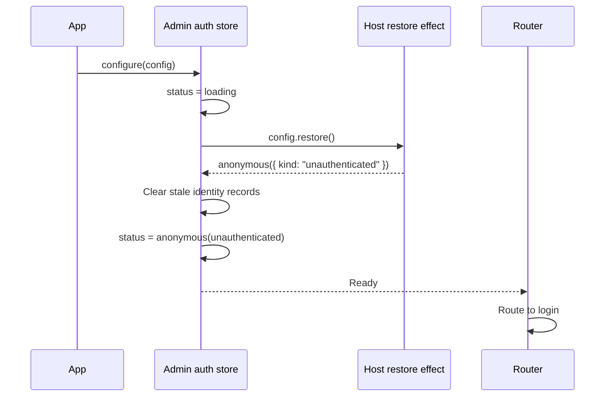

This is ordinary anonymity, not eviction or restoration failure.

## User-requested logout

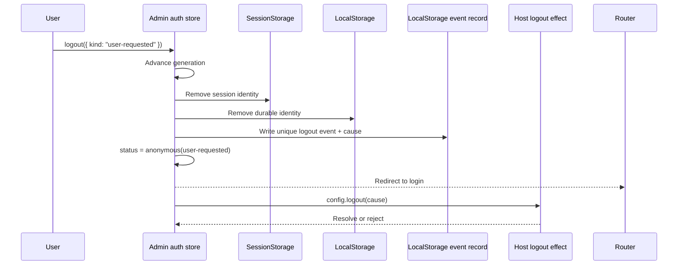

Local eviction occurs before host cleanup. Host callback rejection rejects `logout()` to its caller but never restores cached identity or authenticated state.

## SessionStorage-backed eviction

An API request discovers an expired host session while the presentation identity is tab-scoped.

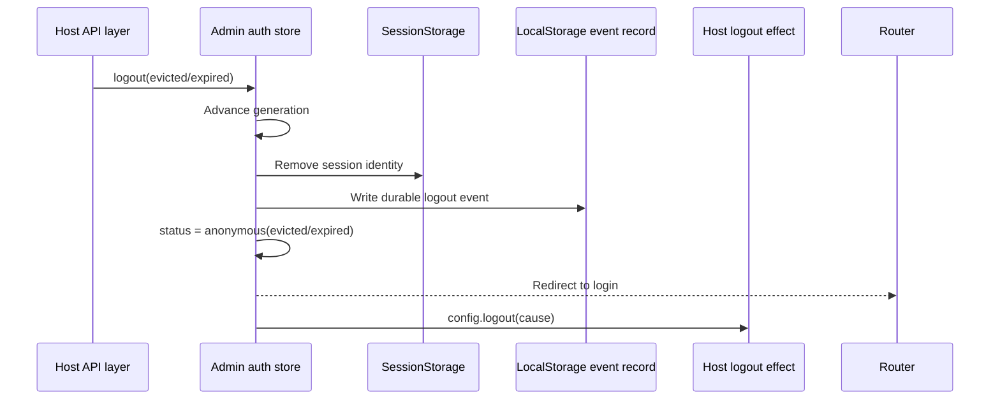

LocalStorage remains the cross-tab coordination channel even when the initiating tab used SessionStorage for its identity.

## LocalStorage-backed eviction


No arbitrary eviction parameter bag crosses the package boundary. New reason-specific data requires a concrete frontend use case and typed contract.

## Cross-tab LocalStorage eviction

Assume Tab A and Tab B share one persistence namespace and both currently present the same remembered identity.

### Initial state

```text
LocalStorage
├── acme-admin:auth:identity
│   └── { version: 1, identity: { userLabel: "Alice" } }
└── acme-admin:auth:event
    └── absent

Tab A: authenticated(Alice), generation 7
Tab B: authenticated(Alice), generation 4
```

### Complete flow

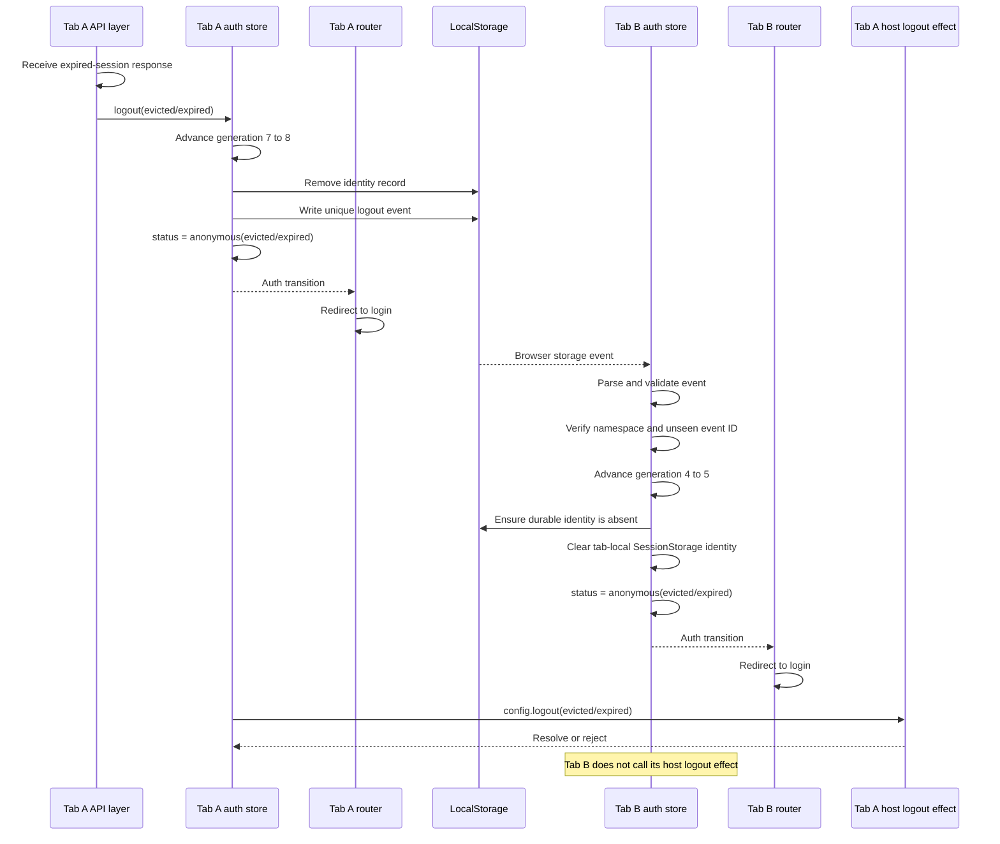

### Event record

Conceptually, Tab A writes:

```ts
localStorage.setItem(
  `${namespace}:auth-event`,
  JSON.stringify({
    version: 1,
    id: crypto.randomUUID(),
    kind: "logout",
    cause: {
      kind: "evicted",
      evictionReason: "expired",
    },
  }),
);
```

The unique event ID ensures that repeated logout operations produce distinct storage events and lets receivers deduplicate already-processed events.

### Passive-tab event handling

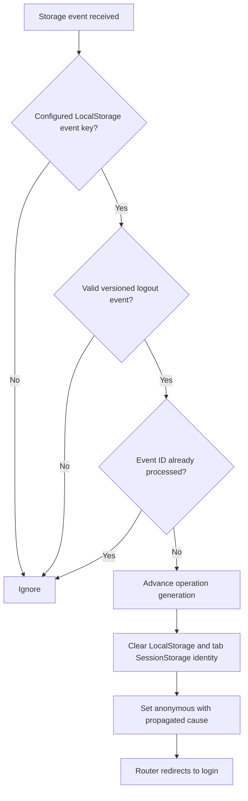

LocalStorage is untrusted input. A receiver validates the storage area, configured key, JSON schema, version, event kind, cause, and event ID before changing state.

Tab B performs only local eviction. It does not invoke its host logout callback because doing so would duplicate backend revocation, SDK side effects, telemetry, and callback failures across every open tab.

### Shared transition, dedicated transport

Cross-tab eviction is not a separate authentication-state algorithm. User logout, direct host eviction, authoritative anonymous restoration, and passive cross-tab invalidation all enter one internal transition:

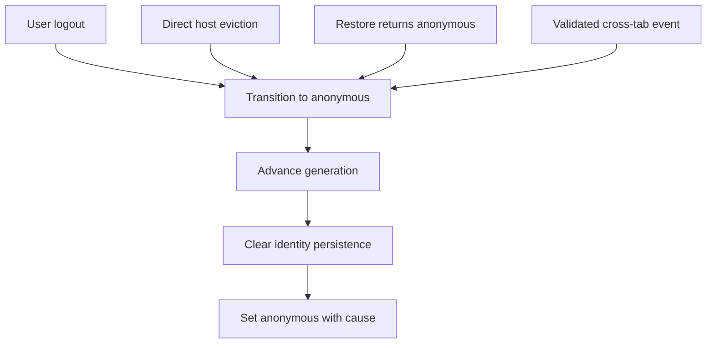

The dedicated LocalStorage mechanism owns only cross-tab delivery, schema validation, event deduplication, and prevention of rebroadcast loops. A passive tab does not invoke the host logout callback.

### Why identity removal does not trigger restoration

The rejected simplification was to remove the LocalStorage identity, let Tab B observe that removal, and make Tab B rerun host `restore()`. That is unsafe as the general eviction mechanism:

- User logout clears package state before host cleanup. Tab B can restore while the cookie session is still valid and re-authenticate itself.
- A `forbidden` eviction may remove access to the Admin application without invalidating the underlying host session. Restoration can correctly return authenticated while application policy requires eviction.
- Removing an already-absent LocalStorage identity may emit no event, and SessionStorage-only identities provide no shared identity key to remove.
- Identity removal carries no tagged Anonymous cause and cannot distinguish logout, expiration, forbidden access, storage cleanup, or migration.
- Offline or failed restoration produces `unavailable` rather than the authoritative eviction already known by Tab A.
- Every open tab would perform avoidable host restoration, token refresh, or SDK initialization work.

The settled design therefore keeps a dedicated versioned invalidation event while sharing the underlying anonymous transition. LocalStorage events may reduce access; identity changes never establish authentication.

### Pending restoration in the passive tab

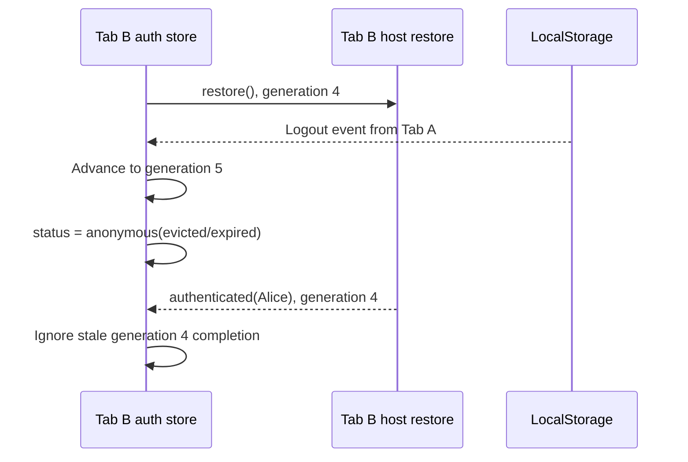

Advancing the generation prevents an older login, restore, or retry completion from re-authenticating the passive tab after eviction.

### Initiating callback failure

If Tab A's host logout callback rejects:

- Tab A remains anonymous.
- Tab B remains anonymous.
- The shared durable identity remains absent.
- Pending auth operations remain invalidated.
- Tab A's action promise rejects so its caller can observe cleanup failure.
- Tab B does not receive or reproduce the callback failure.

### Mixed persistence tiers

If Tab A uses LocalStorage while Tab B uses SessionStorage, Tab B still receives the LocalStorage logout event and clears its own tab-local identity. The event channel is durable and cross-tab even when a receiving identity is not.

## Authoritative restoration eviction

A cached identity exists, but the host reports that the session has expired.

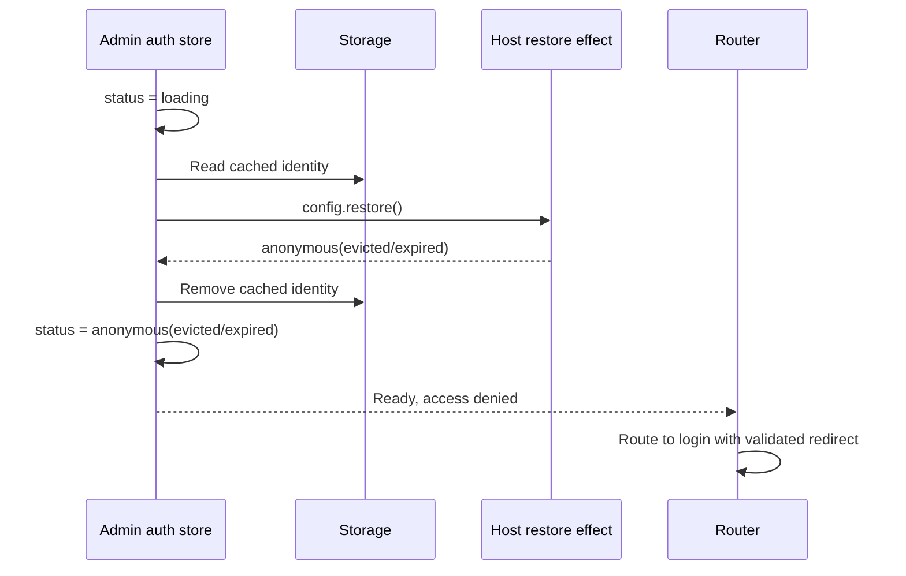

An explicit anonymous restore result is authoritative and clears the cache.

## Restoration unavailable

A timeout, offline browser, or authentication SDK failure does not prove that the host session is invalid.

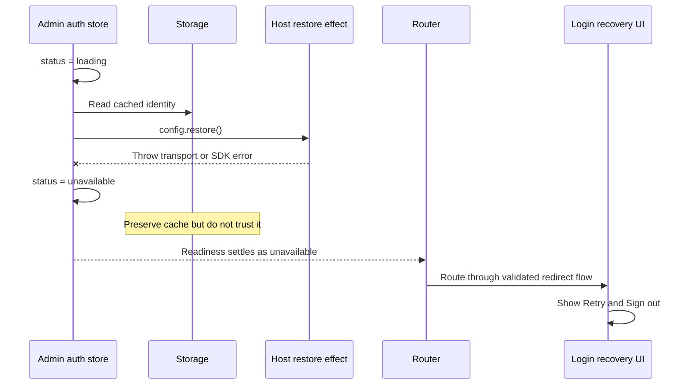

Retry starts a new generation and invokes host restoration again. Success authenticates with a fresh identity and restores the validated original destination. Sign out clears the preserved cache with `{ kind: "user-requested" }`.

## Logout while restoration is pending

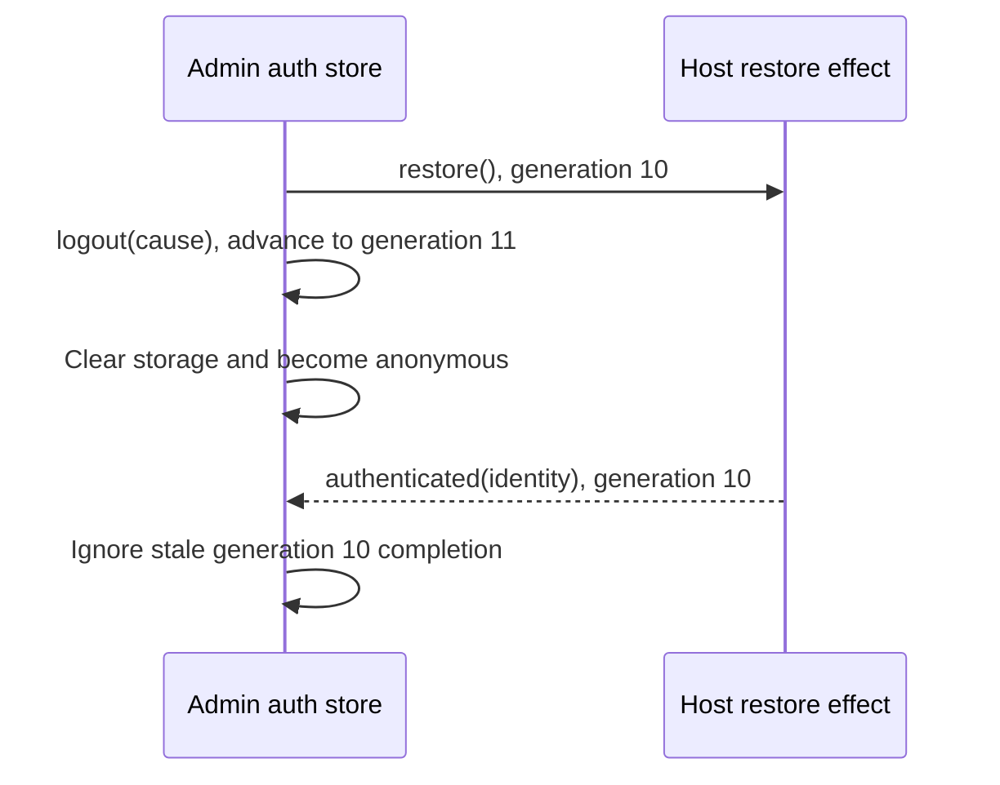

The same latest-generation rule applies to login, restore, retry, user logout, direct eviction, and passive cross-tab eviction.

## State transitions

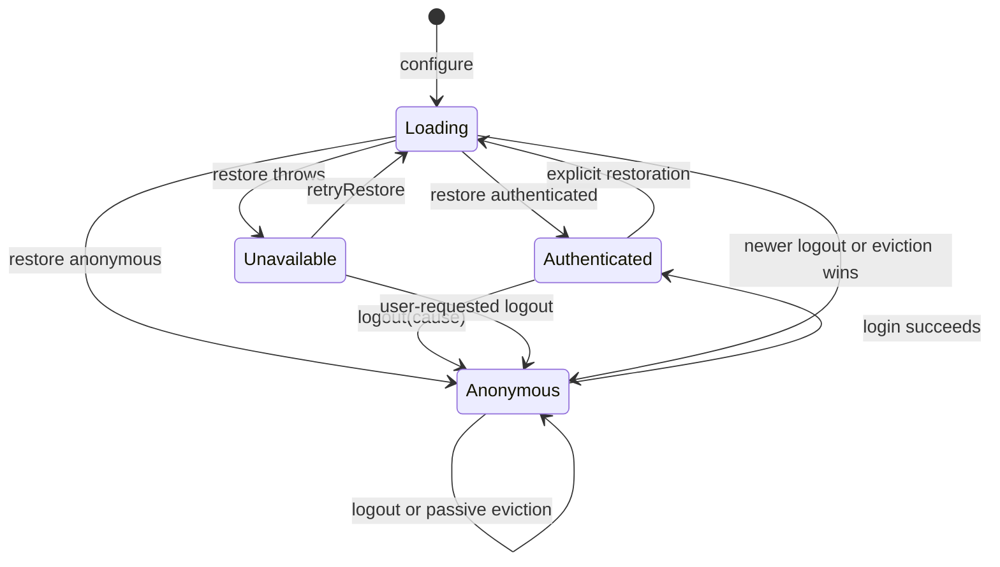

## Invariant

> Browser storage may preserve presentation identity and persistence intent, but only a current host effect may establish `authenticated`. Any newer logout or eviction immediately invalidates older pending operations.

A LocalStorage event may reduce access by evicting a tab. A LocalStorage identity write may never grant access or authenticate another tab.
