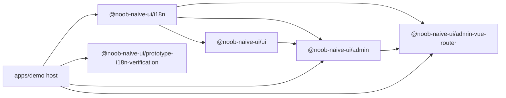

# Repository Overview

`noob-components-v2` is a pnpm workspace that ships **reusable frontend building
blocks for admin applications** (Vue 3 + TypeScript), keeping application policy
and backend integration in the consuming application. It is organized as a set of
router-neutral packages plus one integration package that adapts them to Vue
Router, and a backend-free demo host that exercises the full stack.

The canonical system boundary is documented in
[Architecture — Ownership Contract](ownership-contract.md); the glossary below
comes from `CONTEXT.md`, which is authoritative for domain vocabulary.

## Workspace map

```text
apps/
  admin-starter/   package "admin-starter" — placeholder, not scaffolded (dev script prints a stub)
  demo/            package "demo" — backend-free host application (Vite dev/build)
packages/
  i18n/            @noob-naive-ui/i18n — shared library i18n plugin factory + component i18n registry
  ui/              @noob-naive-ui/ui — theme bridge (marked obsolete) + empty i18n plugin
  admin/           @noob-naive-ui/admin — router-neutral admin shell, login page, stores, naive-ui config
  admin-vue-router/@noob-naive-ui/admin-vue-router — Vue Router lifecycle integration (registry, navigation adapter, plugin-owned router)
  prototype-i18n-verification/ @noob-naive-ui/prototype-i18n-verification — PrototypeCard + standalone i18n plugin
tooling/
  vite/            vue-i18n.ts (workspace locale Vite preset + HMR companion), json-locale-types.ts (JSON→TS type generator + Vite plugins)
docs/
  adr/             ADR-0001 (shell/router/host ownership), ADR-0002 (exact contract)
  admin-auth-restoration-data-flows.md, admin-auth-restoration-grilling.md, admin-i18n-design-options.md — design history
  agents/          agent conventions: domain docs, issue tracker, triage labels
```

## Dependency direction



- `@noob-naive-ui/i18n` is the foundation: it depends only on `vue`, `vue-i18n`,
  `zod`, and `tsafe`. Every other package either consumes it directly
  (admin, ui, admin-vue-router) or re-implements its contract standalone
  (prototype-i18n-verification).
- `@noob-naive-ui/admin` depends on `i18n` and `ui` and on Naive UI,
  `pro-naive-ui`, Pinia, and `@vicons/ionicons5`. It **never imports
  vue-router** (router-neutrality is an invariant, enforced by `external` lists
  and by design).
- `@noob-naive-ui/admin-vue-router` depends on the admin package contracts and
  owns all Vue Router coordination; it is the only package that imports
  `vue-router`.
- The host application (`apps/demo`) depends on every shared package and supplies
  all application policy (auth effects, menus, routes, tab presentation, scope).

All workspace dependency versions for the shared catalog (vue, vue-i18n,
naive-ui, pinia, pro-naive-ui, zod, vue-router) are pinned in `pnpm-workspace.yaml`
`catalog` and referenced as `catalog:` in package manifests.

## Package build and declaration pipeline

Every library package builds with `vite build` in ES library mode
(`vite.config.ts` → `build.lib`), and every package emits its public
declarations with `unplugin-dts` (`dts({ tsconfigPath: "./tsconfig.build.json" })`,
which extends `tsconfig.library.json` → `tsconfig.vite.json`; declaration maps are
enabled). Output lands in `dist/index.js` + `dist/index.d.ts` plus optional CSS.

**Dependency externalization**: every package build externalizes its runtime
dependencies (workspace and third-party) via `rolldownOptions.external`, so
`dist/index.js` never bundles them. `@noob-naive-ui/admin` externalizes
`@vicons/ionicons5`, `@noob-naive-ui/i18n`, `@noob-naive-ui/ui`, `naive-ui`,
`pinia`, `pro-naive-ui`, `vue`, `vue-i18n`, and `zod`; `@noob-naive-ui/ui`
externalizes `@noob-naive-ui/i18n`, `naive-ui`, `vue`, and `vue-i18n`. The same
`external` lists double as the router-neutrality enforcement for admin (no
`vue-router` entry means a stray admin import would be bundled, breaking the
invariant).

**`./style.css` subpath export contract** (admin and ui only):
- `package.json` declares `exports["./style.css"]: "./dist/style.css"` and
  `sideEffects: ["**/*.css"]` so bundlers keep the CSS import.
- `vite.config.ts` sets `cssFileName: "style"` in the library build.
- The stylesheets are Tailwind v4 CSS:
  - `packages/ui/src/style.css`: declares `@layer theme, base, components,
    utilities;`, imports `tailwindcss/theme.css` and
    `tailwindcss/utilities.css` (`source(none)`), and **disables preflight**
    (the `tailwindcss/preflight.css` import is commented out). `@source "."`
    scopes scanning to the ui package.
  - `packages/admin/src/style.css` imports
    `@noob-naive-ui/ui/style.css` and `@source "./components"` so Tailwind scans
    the admin components; preflight is likewise disabled.
- Because preflight is disabled, the **host application must import the stylesheet
  explicitly** (the demo imports `@noob-naive-ui/admin/style.css` in
  `apps/demo/src/main.ts`) and owns its own base/reset decisions.

**Generated locale types → emitted declarations chain** (admin):
`tooling/vite/json-locale-types` regenerates
`packages/admin/src/locales/locale-types.generated.ts` from the locale JSON files
at build start. The generated module lives **under `src/`** deliberately so the
declaration build emits a sibling `dist/locales/locale-types.generated.d.ts` and
the exported `AdminShellLocale`/`AdminLoginPageLocale` types stay resolvable for
consumers without JSON references in published declarations (rationale documented
in `packages/admin/src/i18n/admin-locale.ts`). Editing a locale JSON without
regenerating (or committing) the generated module breaks typechecks; see
[Tooling — Vite plugins](../tooling/vite-plugins.md).

Root scripts (`package.json`) drive the workspace:
- `pnpm build` — recursive `vite build` in every package (admin-starter is a stub).
- `pnpm typecheck` — recursive `tsc -p tsconfig.json --noEmit` per package.
- `pnpm lint` / `lint:fix` — `oxlint --type-aware` (config `.oxlintrc.json`).
- `pnpm format` / `format:check` — `oxfmt`.
- `pnpm dev` — currently forwards to the not-yet-scaffolded `admin-starter`;
  run the demo with `pnpm --filter demo dev` instead.
- `pnpm test` — per-package `vitest run` (see [Testing](../testing.md)).

The root `tsconfig.json` maps the workspace package names to their **source**
entrypoints (`@noob-naive-ui/admin` → `packages/admin/src/index.ts`, etc.), and
`apps/demo/vite.config.ts` mirrors this with `resolve.alias` entries, so editors
and the dev server consume TypeScript sources directly.

## Domain glossary (from CONTEXT.md)

| Term | Meaning |
|---|---|
| Admin shell | Router-neutral application chrome: navigation, page instances, account controls, local display preferences. Owned by `@noob-naive-ui/admin`. |
| Admin router runtime | The integration coordinating Vue Router navigation and browser history with Admin-shell page instances. Owned by `@noob-naive-ui/admin-vue-router`. |
| Host application | The consuming application owning authentication effects, backend integration, menu policy, route definitions, and application pages. |
| Navigation target key | A stable host-defined key identifying an abstract navigable destination; represented as both an `AdminRouteRegistry` key and a Vue Router route name. |
| Destination | A navigation target key plus its canonical payload; two destinations are equal when key **and** canonical payload are equal. |
| Page instance | One identity-bearing open occurrence of a destination; equal destinations may have distinct page instances. |
| Navigation scope | A host-defined browser-history isolation epoch preventing page history from crossing an authenticated-context transition; not a session, authorization boundary, or credential. |
| Authentication state | The admin package's frontend determination that auth is loading, anonymous, or authenticated; presentation/routing state, not proof of a host session. |
| Anonymous cause | Why the auth state is anonymous: no auth established, user sign-out, or host eviction for a classified reason. |
| Vue functional component | A plain rendering function taking props (optionally `SetupContext`) and returning a VNode/JSX; **not** `defineComponent`. |

## Repository conventions and auxiliary docs

- `AGENTS.md` / `CLAUDE.md` — AI-assistant operating rules; both carry an
  OpenWiki block stating the `openwiki/` evidence index is optional just-in-time
  context, that source and tests are authoritative, and that generated OpenWiki
  pages are refreshed by a scheduled workflow, not hand-edited.
- `.github/workflows/openwiki-update.yml` — daily OpenWiki regeneration and
  PR creation (`openwiki code --update --print`).
- `docs/adr/0001-separate-shell-router-and-host-ownership.md` and
  `docs/adr/0002-admin-shell-router-host-contract.md` — the settled ownership
  decision and its exact contract; summarized in
  [Ownership Contract](ownership-contract.md).
- `docs/agents/domain.md` — how agent skills should consume domain docs and
  vocabulary; `docs/agents/issue-tracker.md` and `docs/agents/triage-labels.md`
  cover issue workflow.

## Out of scope

Trellis-managed working state (`.trellis/`), local tool caches (`.omp/`,
`.gitnexus/`, `.fallow/`, `.codegraph/`), `conversation_history/`, coverage
outputs, `node_modules`, and `dist` build artifacts are excluded from the wiki by
`.openwikiignore`.
