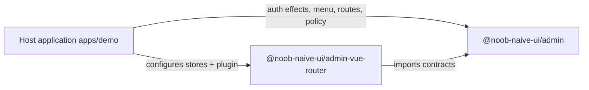
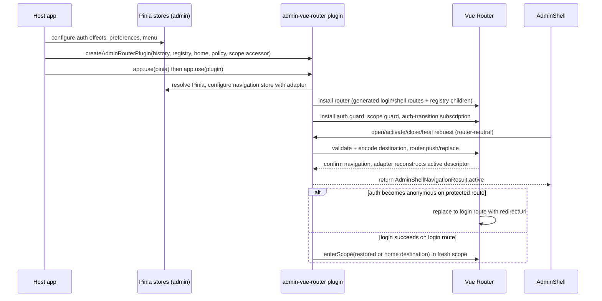

# Ownership Contract — Shell, Router Runtime, and Host

The repository implements one system-wide decision (ADR-0001) with an exact
contract (ADR-0002): **three owners with one-way dependencies**.

## The three owners

### `@noob-naive-ui/admin` — router-neutral Admin shell

Owns presentation and router-neutral state:

- `AdminShell` and `AdminLoginPage` presentation components (JSX).
- Package-owned Pinia stores: auth presentation state, opaque `MenuOption[]`
  menu, router-neutral `AdminShellNavigation`, and local shell preferences.
- The `AdminShellDestination` value: stable host-defined `navKey` + optional
  canonical plain-object `payload`.
- Page-instance membership, ordering, pending state, close fallback, and
  immutable page-instance identity (`AdminShellTabDescriptor.id`).
- Open, activate, close, and **heal** requests sent through the configured
  `AdminShellNavigation` controller. A heal restamps the current browser-history
  entry in place with an exact committed page instance, so a history revive of a
  closed tab whose destination already has a committed instance never surfaces a
  duplicate tab.

Hard boundaries: the admin package **does not** import Vue Router, interpret route
records, filter menu visibility, call backend APIs, own session data, or package
business pages. The host-authoritative `AdminShellNavigation.active` value controls
selected menu and tab state. Destination equality is navKey + payload equality;
several page instances may represent equal destinations. "Page instance" is the
domain concept; "tab" is only its current visual representation (and remains in
some public type names).

### `@noob-naive-ui/admin-vue-router` — admin router runtime

Depends only on the admin package's contracts and owns all Vue Router lifecycle
integration (see [admin-vue-router overview](../packages/admin-vue-router/overview.md)):

- `AdminRouteRegistry`: binds host-defined navigation target keys to child route
  records and optional reversible payload codecs.
- Conversion between router-neutral destinations and named Vue Router locations.
- Generated login and authenticated-shell route records via
  `createAdminRouterPlugin()`.
- Configuration of the Admin-shell navigation store with a Vue Router-backed
  controller.
- Auth guards, post-login redirect restoration, logout routing, authenticated
  navigation-scope entry, stale-history scope repair, and deterministic
  guard/subscription disposal (`ADMIN_DISPOSE_KEY`).
- Browser-history metadata needed to reconstruct page-instance descriptors
  without exposing Vue Router state to the Admin shell.

The runtime treats the bound router and its current route/history state as
navigation authority. It does not define host routes, payload meaning,
page-instance labels, closability policy, page IDs, navigation-scope IDs, menus,
backend integration, or business pages.

### Host application — the consumer

Supplies (the demo in `apps/demo/src/main.ts` is the reference example):

- the Pinia instance and the Vue Router history implementation;
- auth effects (`login`/`logout`/`restore`) configured into the admin auth store —
  callbacks return frontend presentation identity while the package store owns
  auth-state transitions;
- shell-preference defaults and available locales;
- the final `MenuOption[]` (hierarchy, visibility, labels, stable keys);
- route definitions, page components, and reversible payload codecs through
  `AdminRouteRegistry`;
- `homeDestination`, destination-to-page-instance presentation policy,
  page-instance ID generation, and navigation-scope ID generation;
- backend clients, session restoration, permissions, application state, and
  business pages.

The host must configure auth, preferences, and menu state **before** creating and
installing the router, and must keep menu keys and route-registry navigation keys
aligned where menu selection should navigate to a registered destination.

## Runtime flow

*End-to-end runtime flow from host configuration through router-bound navigation and auth transitions.*

Concrete flow steps (ADR-0002):

1. Host creates Pinia and configures auth callbacks, preferences, and the final
   menu tree.
2. Host calls `createAdminRouterPlugin()` with history, route registry, home
   destination, descriptor policy, page-ID factory, and navigation-scope
   accessor, then installs the plugin **after** `app.use(pinia)`.
3. During install the runtime resolves Pinia via `getActivePinia()`, generates
   login/shell routes, installs auth and history-scope guards, and configures the
   shell's router-neutral navigation store.
4. `AdminShell` renders the host menu unchanged and emits destination-based open,
   activate, or close requests.
5. The runtime validates and encodes destinations, performs Vue Router
   navigation, reconstructs the confirmed active page descriptor from
   route/history authority, and returns it to the shell controller.
6. Auth-state transitions drive router effects: anonymous access to protected
   routes goes to login; successful login enters a fresh navigation scope at a
   restored or home destination; logout from a protected route returns to login.

## Invariants and consequences

- Application assembly is explicit: hosts must supply several policies, but the
  shared packages stay independent of backend DTOs, session models, permission
  payloads, business routes, and host-specific menu derivation.
- Router lifecycle complexity stays isolated in `admin-vue-router`; the Admin
  shell remains testable through a router-neutral command contract.
- A navigation scope exists only to isolate browser-history entries across
  host-defined authenticated-context transitions. It is **not** an
  authentication/session mechanism, authorization boundary, or security
  credential; the host decides when a context transition rotates it.

## Design history

- `docs/adr/0001-separate-shell-router-and-host-ownership.md` — the ownership
  decision and the alternatives it rejected (router-aware or backend-aware shell).
- `docs/adr/0002-admin-shell-router-host-contract.md` — the exact current
  contract, including the demo example.
- `docs/admin-auth-restoration-data-flows.md` and
  `docs/admin-auth-restoration-grilling.md` — settled auth data-flow analysis and
  design-gap notes; note that parts of these documents (tagged eviction causes,
  unavailable recovery, cross-tab invalidation) describe sequenced future work,
  not current code. The source of truth is the [auth store](../packages/admin/auth.md).
- `docs/admin-i18n-design-options.md` — design comparison that motivated the
  explicit library i18n plugin approach implemented in
  [i18n package](../packages/i18n.md).
