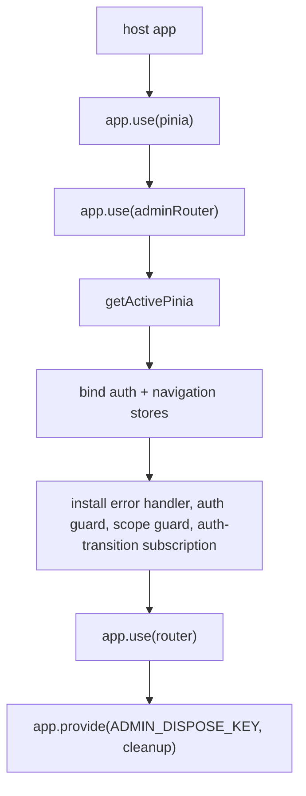

# Admin Router Plugin — createAdminRouterPlugin

`createAdminRouterPlugin(options)` (`create-admin-router.ts`) is the host-facing
integration point: it creates the **complete Vue Router instance** eagerly and
returns an installable Vue plugin that binds the admin stores, registers
lifecycle handlers, installs the router, and provides deterministic cleanup under
`ADMIN_DISPOSE_KEY`. The host installs it **after** `app.use(pinia)` — it
resolves stores via `getActivePinia()` and throws if Pinia is not active.

## Options (`CreateAdminRouterOptions<TDefinitions>`)

| Option | Responsibility |
|---|---|
| `history: RouterHistory` | Host-selected history implementation/mode/base. |
| `registry: AdminRouteRegistry<TDefinitions>` | Destination conversion and shell child routes. |
| `homeDestination: AdminShellDestination` | Fallback route when redirect validation fails or scope is lost. |
| `shellRoute?`, `loginRoute?` | `AdminRouteOverride` — override the package-owned path, inner presentation component, or additive `meta`. |
| `describeDestination(id, destination)` | Host tab label and closability policy. |
| `createPageId()` | Host page-instance identity factory. |
| `getNavigationScopeId()` | Host navigation-scope accessor (rotated across authenticated-context transitions). |
| `additionalRoutes?` | Non-admin public sibling routes appended outside the shell parent. |
| `scrollBehavior?` | Host scroll policy forwarded to Vue Router. |

## Generated routes

- Internal route names are package-owned: `_noobAdminLogin`
  (`ADMIN_LOGIN_ROUTE_NAME`) and `_noobAdminShell` (`ADMIN_SHELL_ROUTE_NAME`);
  default paths `/login` and `/` (must be distinct — otherwise the factory
  throws).
- Login route renders `AdminLoginPage` (or `loginRoute.innerComponent`) inside the
  package-owned wrapper `AdminRouterLoginRoute`
  (`createLoginRouteComponent`, plain inner render); the shell route renders
  `AdminShell` (or `shellRoute.innerComponent`) inside `AdminRouterShellRoute`
  (`createShellRouteComponent`), which nests a `RouterView` so host pages render
  inside the shell. Both wrapper names are set via `defineComponent` `name`, so
  they are the stable component identities hosts see for the generated records.
- **Reserved metadata key**: host meta is merged beneath the package namespace,
  and a host-supplied `_noobAdminMeta` key is stripped (destructured out and
  discarded) from **both** override metas. The shell record is then stamped with
  the package's own `_noobAdminMeta: { requiresAuth: true }`; the login record
  gets no `_noobAdminMeta` at all, so it is never flagged protected.
  `requiresAdminAuth(meta)` reads only the namespaced field, so host metadata can
  never accidentally toggle protection.
- Shell children come from `registry.toRouteRecords()`; `additionalRoutes` are
  siblings, validated against internal names/paths and registry names (factory
  throws on any collision).

## Guards and effects (installed in this order)

1. **Router error reporter** (`router.onError`): logs navigation failures to
   stderr so detached lifecycle effects never leave Vue Router to classify a
   handled rejection as uncaught.
2. **Auth guard** (`router.beforeEach`): while `auth.status.kind === "loading"`
   it awaits `auth.waitForRestoration()` before evaluating the destination, so
   protected content is never rendered optimistically. After settlement:
   - protected target + not authenticated → redirect to
     `{ name: _noobAdminLogin, query: { redirectUrl: to.fullPath } }`;
   - authenticated user on the login route → redirect to home navKey.
3. **History-scope guard**: delegated to the navigation runtime's
   `installScopeGuard()` (see [navigation runtime](navigation-runtime.md)).
4. **Auth-transition subscription** (`auth.$subscribe(..., { detached: true })`,
   plus an immediate run): drives login scope entry and logout routing. Each
   status change runs through `runAuthTransition` — the failure-containment
   wrapper that fires `handleAuthTransition` detached and catches/suppresses
   recoverable router failures (`console.error("Unknown Error: " + err)`), so
   Vue Router never classifies a handled rejection as an uncaught navigation
   error.
   - `loading` → **explicit no-op**: `handleAuthTransition` returns immediately
     (no redirect, no scope entry); the auth guard awaits restoration and the
     subscription re-fires once status settles to `authenticated` or
     `anonymous`.
   - `anonymous` → reset pending scope-entry; if the current route is protected,
     `router.replace({ name: _noobAdminLogin })`.
   - `authenticated` while on the login route → resolve the post-login
     destination and `enterScope` it.
   - `scopeEntryPending` prevents duplicate concurrent scope entries; a rejected
     scope entry resets the flag in `finally` so a later eligible attempt still
     runs (test: "rejected scope entry still allows a later authenticated
     transition to enter scope").

## Post-login redirect restoration

`resolvePostLoginDestination(redirectUrl, router, ctx)`:

- rejects non-path strings and protocol-relative paths (`//...`),
- resolves the URL through the router and requires it to match a protected
  registered route (never the login route),
- reconstructs the destination via `registry.fromRoute` inside try/catch —
  malformed codec payloads or history-state-dependent decodes fall back to
  `homeDestination` (tests: "malformed codec payload falls back to home",
  "history-state-dependent redirect falls back to home", "valid protected
  redirect URL restores destination", "preserves deep link path in redirectUrl
  query").

## Disposal — `ADMIN_DISPOSE_KEY`

`app.provide(ADMIN_DISPOSE_KEY, () => { for (const fn of cleanupFunctions) fn(); })`
removes the error handler, auth guard, scope guard, and auth-transition
subscription **in registration order**. Resolve via
`inject(ADMIN_DISPOSE_KEY)` inside component setup, or
`app.runWithContext(() => inject(ADMIN_DISPOSE_KEY))` at app scope. The dispose
call is idempotent in effect (each removal function unregisters exactly what it
installed).

## Override surface

`AdminRouteOverride` (`path?`, `innerComponent?`, `meta?`) is the constrained
host extension seam for the generated routes: hosts can relocate login/shell
paths, swap the presentation inside the package-owned route wrapper, and add
additive metadata — without touching name ownership or auth metadata. Type-level
tests pin `CreateAdminRouterOptions` acceptance of registry-typed definitions and
`AdminRouteOverride` shape.

## Tests — `tests/create-admin-router.test.ts`

- contract/validation: configured Router with internal routes; default login
  `/login` and shell `/`; auth metadata stamped only on the shell parent;
  identical login/shell paths rejected; additional-route collisions rejected
  (internal names, registry names, internal paths); valid additional routes
  accepted; custom paths; innerComponent overrides render inside wrappers; meta
  merge and namespace separation.
- install: only the shell-facing controller is configured into Pinia; throws
  when installed before Pinia; rejects double install; dispose removes installed
  effects; registry children resolve under the shell path; additional routes are
  siblings; scrollBehavior forwarded.
- auth flow: anonymous → login with redirectUrl; authenticated → home; protected
  access allowed; login route and additional public routes allowed anonymously;
  deep-link preservation; restoration wait before admitting protected
  navigation; anonymous after unsettled restoration; concurrent waiters settle;
  protected content not rendered while restoration pending; rejected scope entry
  retry; redirect fallbacks (malformed codec, history-state-dependent); valid
  protected redirect restoration.

## Related

- [admin-vue-router overview](overview.md)
- [Navigation runtime](navigation-runtime.md) — scope guard and `enterScope`
- [Route registry](route-registry.md) — children and redirect decoding
- [Admin auth store](../admin/auth.md) — the status model and
  `waitForRestoration`
- [Demo host](../../apps/demo.md) — end-to-end plugin usage
