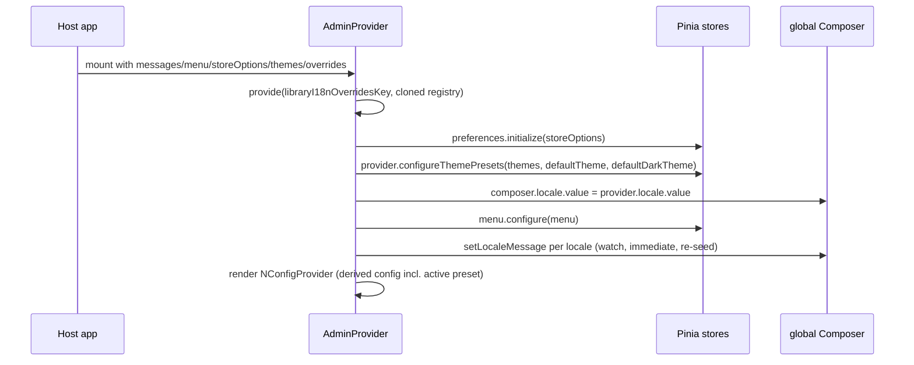

# AdminProvider and useAdminProvider

`AdminProvider` (`components/admin-provider.tsx`) is the admin package's
**props-driven root provider**: it owns mount-safe host configuration that
previously lived hand-wired in the demo's `main.ts`/`App.tsx`. Hosts mount it once
under a configured Pinia and a global vue-i18n Composer, and it:

1. provides the admin package's i18n text-override snapshot to descendants
   (replacing the former per-package `app.use(adminI18nPlugin, { messages })`
   install — see [Admin i18n](i18n.md));
2. initializes the shell-preferences store from `storeOptions` (see
   [Preferences](preferences.md));
3. configures the shell menu store from the `menu` prop;
3b. configures the host-supplied theme presets and polarity defaults from the
   `themes`/`defaultTheme`/`defaultDarkTheme` props (`provider.configureThemePresets` —
   see [Preferences](preferences.md));
4. seeds the host global Composer with the hydrated preference locale and with
   per-locale messages from `messages`, re-seeding on prop change (the HMR path);
5. renders a Naive UI `NConfigProvider` whose theme/locale/componentOptions
   derive from the preferences store (including the active theme preset).

`useAdminProvider` (`use-admin-provider.ts`) is the **single public consumption
surface** for the package's presentational state (theme, locale, font size,
sidebar, menu) plus the derived presentation config. Consumers import
`AdminProviderApi` and call `useAdminProvider()`; the underlying Pinia stores
remain an implementation detail.

## Props (`AdminProviderProps`)

| Prop | Type | Meaning |
|---|---|---|
| `messages` | `Record<string, Record<string, unknown>>` | Per-locale message resources seeded into the host global Composer (`setLocaleMessage` per locale). |
| `menu` | `AdminMenuTree` (`MenuOption[]`) | The shell sidebar menu, configured into the menu store (configure-once). |
| `storeOptions?` | `AdminShellPreferencesStoreOptions` | Preferences `defaults`, `storage`, and `fallbackLocale` (see [Preferences](preferences.md)). |
| `themes?` | `AdminThemePreset[]` | Host-supplied selectable theme presets for the navbar dropdown (see [Preferences](preferences.md)). |
| `defaultTheme?` | `string` | Default light preset key, used while mode is `"system"` and the OS is light. |
| `defaultDarkTheme?` | `string` | Default dark preset key, used while mode is `"system"` and the OS is dark. |
| `overrides?` | `LibraryI18nOverridesRegistry` | The shared libraryId-keyed override registry (from `@noob-naive-ui/i18n`), e.g. `{ "noob-naive-ui:admin": {...} satisfies AdminLocaleOverrides }`; provided under `libraryI18nOverridesKey`, which `createComponentI18n` reads to merge package text. |

The host must `app.use(i18n)` and `app.use(createPinia())` before mounting this
component.

## Setup ordering (`components/admin-provider.tsx`)

*AdminProvider mount ordering: override registry, store initialization, Composer seeding, and derived config rendering.*

- The override registry is defensively `structuredClone`d per entry before
  `provide`, so mutating the host's objects after mount cannot affect current or
  future mounts. The registry carries entries for every component package by
  `libraryId` (admin, ui, …), not just admin — see [i18n package](../i18n.md).
- Store initialization is idempotent across Vue HMR remounts because the
  preferences and menu stores once-guard their own initialization (a fresh
  provider setup re-uses the same store state).
- Seeding the Composer **locale** before child setup means the pre-auth login
  page renders the restored locale; `AdminShell` keeps synchronizing afterwards
  via `useGlobalI18nSync`.

## `useAdminProvider` API (`AdminProviderApi`)

State members are reactive refs (`Ref`/`ComputedRef`); actions are bound store
methods.

| Member | Kind | Meaning |
|---|---|---|
| `themeMode`, `themeKey`, `fontSize`, `locale`, `availableLocales`, `sidebarCollapsed` | `Ref` | Persisted preference fields projected from the store's `preferences` blob (`themeKey` is `""` until a preset is picked). |
| `themes` | `Ref<AdminThemePreset[]>` | Host-supplied selectable theme presets (navbar dropdown options; runtime-only, never persisted). |
| `activeTheme` | `ComputedRef<AdminThemePreset \| undefined>` | The resolved active preset, or undefined when none matches (see [Preferences](preferences.md)). |
| `isHydrated` | `Ref` | True once preferences have been hydrated from storage. |
| `preferences` | `ComputedRef<AdminShellPreferences>` | Full normalized snapshot (defensive copy of locale options). |
| `naiveUiConfig` | `ComputedRef<AdminNaiveUiConfig>` | Derived `NConfigProvider` props: base theme from the active preset (or `resolveDefaultNaiveUiTheme` with the runtime dark signal), `themeOverrides` deep-merged via `mergeAdminNaiveUiThemeOverrides`, naive-ui `locale` (host fallback aware), per-component `componentOptions`. |
| `proLayoutConfig` | `ComputedRef<ProLayoutProps>` | `{ collapsed: sidebarCollapsed }` for ProLayout. |
| `menu` | `Ref<AdminMenuTree>` | Reactive shell menu options. |
| `setThemeMode`, `setTheme`, `setFontSize`, `setLocale`, `setSidebarCollapsed`, `toggleSidebar`, `setAvailableLocales` | action | Write preference fields (`setTheme` pins the mode to the selected preset's polarity). |
| `configureThemePresets` | action | Writes the host-supplied preset list and polarity defaults into the runtime blob. |
| `setSystemUsesDark` | action | Runtime-only browser dark-mode signal (host `matchMedia` listener), never serialized. |
| `reset`, `replacePreferences` | action | Blob-level preference operations (composable normalizes input before calling). |

Invariants proven by `use-admin-provider.test.ts`:

- **Pure projection**: `useAdminProvider` never initializes or configures the
  stores; before a consumer calls `preferences.initialize` /
  `menu.configure`, it surfaces the stores' unconfigured defaults
  (`isHydrated === false`, empty menu, locale `"en"`).
- **Store-owned state**: actions call through to the store blobs; derived
  config recomputes from raw store state (e.g. `setSystemUsesDark(true)` flips
  the system-mode theme to dark; `setFontSize("large")` re-sizes every
  component tier).
- **Theme-preset resolution**: `activeTheme` derives from the runtime presets,
  polarity defaults, mode, `themeKey`, and dark signal; `setTheme(key)` pins the
  mode to the preset's polarity; `naiveUiConfig` merges the preset's color
  overrides with the font-size tier (proven by "resolves the active theme preset
  and merges its overrides").
- **Defensive snapshots**: `preferences` copies locale options; `naiveUiConfig`
  never exposes a global `size` knob — per-component sizes only.

## Change surface

To add a new persisted preference field:

1. Extend `AdminShellPreferences` in `runtime-contract.ts` and the
   `normalizedShellPreferencesSchema` in `runtime/shell-preferences.ts`
   (persisted shape stays a deliberate subset — see [Preferences](preferences.md)).
2. Project it in `useAdminProvider` (`toRef(store.preferences, ...)` + expose an
   action) and add the field to the `preferencesSnapshot` computed.
3. Optionally surface it through an `AdminProvider` prop if the host supplies
   the default.
4. Extend `shell-preferences.test.ts` (persistence) and
   `use-admin-provider.test.ts` (projection/derivation).

To migrate a host from the manual wiring (old demo `main.ts` pattern) to
`AdminProvider`: move `preferences.initialize(...)`, the global-Composer locale
seed, `menu.configure(...)`, theme-preset configuration
(`configureThemePresets`), and the former per-package plugin override install
into `<AdminProvider messages menu storeOptions themes defaultTheme
defaultDarkTheme overrides>`, then delete the manual calls. The `overrides` prop
supplies the shared libraryId-keyed registry in place of
`app.use(adminI18nPlugin, { messages })` ([Admin i18n](i18n.md)). The demo at
[apps/demo](../../apps/demo.md) is the reference migration.

## Tests

- `packages/admin/tests/admin-provider.test.tsx` (7 `it`): seeds the global
  Composer on mount; re-seeds when the `messages` prop changes; initializes the
  preferences store from `storeOptions`; configures the menu store from
  `menu`; renders an `NConfigProvider` wrapping the default slot; configures
  the theme presets and polarity defaults from props; provides the admin
  text-override snapshot under `libraryI18nOverridesKey` (registry entry for
  `"noob-naive-ui:admin"`).
- `packages/admin/tests/use-admin-provider.test.ts` (5 `it`): reactive
  projection from configured stores; action call-through; pure-projection
  invariant; derivation of `preferences`/`naiveUiConfig`/`proLayoutConfig`
  from raw store state; active theme-preset resolution and override merging.

Narrowest validation: `pnpm --filter @noob-naive-ui/admin test
tests/admin-provider.test.tsx tests/use-admin-provider.test.ts`.

## Related

- [Admin overview](overview.md) — the public barrel this page is exported from
- [Preferences](preferences.md) — the store blobs `useAdminProvider` projects
- [Admin i18n](i18n.md) — the shared override registry replaced the per-package
  `adminI18nPlugin`
- [Shell](shell.md) — AdminShell and the navbar controls consume the provider
- [Demo host](../../apps/demo.md) — reference host mount
bs `useAdminProvider` projects
- [Admin i18n](i18n.md) — the shared override registry replaced the per-package
  `adminI18nPlugin`
- [Shell](shell.md) — AdminShell and the navbar controls consume the provider
- [Demo host](../../apps/demo.md) — reference host mount
](i18n.md) — the shared override registry replaced the per-package
  `adminI18nPlugin`
- [Shell](shell.md) — AdminShell and the navbar controls consume the provider
- [Demo host](../../apps/demo.md) — reference host mount
