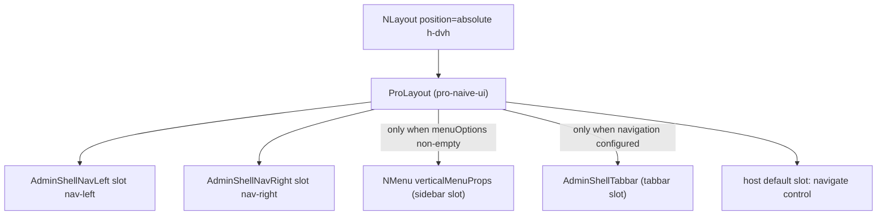
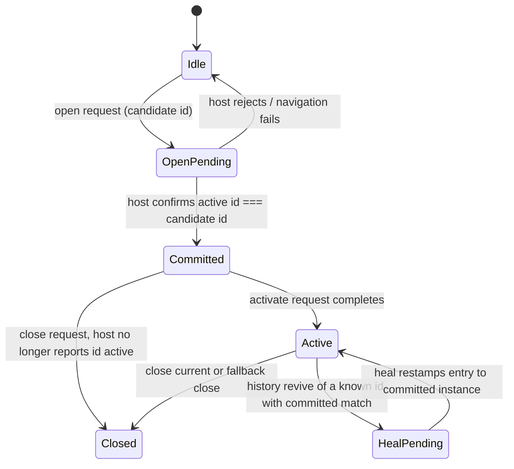

# Admin Shell — Layout and Page-Instance State Machine

`AdminShell` (`components/admin-shell.tsx`) is the router-neutral application
chrome. It composes `pro-naive-ui`'s `ProLayout` inside a Naive UI `NLayout`, with
slot content: sidebar menu, tabbar, nav-left/nav-right controls, and the host
default slot. It renders the host menu unchanged and emits destination-based
navigation requests through the configured `AdminShellNavigation` controller —
never through vue-router directly.

## Layout composition

- `useLayoutMenu` (pro-naive-ui) computes the vertical menu props from
  `provider.menu` (the `useAdminProvider` surface — see
  [Root Provider](provider.md)); `activeKey` is kept in sync with
  `nav.navigation?.active?.nav.navKey` by a watcher (`immediate: true`), so tab
  activation, history traversal, and programmatic navigation all keep the
  highlighted menu key aligned.
- A second watcher turns menu `activeKey` changes into
  `shellContext.navigate({ navKey })` — the single menu → navigation seam; the
  active-key guard stops programmatic navigation from re-navigating through it.
- `showSidebar` is false when the menu tree is absent/empty; `showTabbar` is
  false until a navigation controller is configured. `ProLayout` receives
  `provider.proLayoutConfig` (sidebar collapse state) and the collapse callback
  writes back through `provider.setSidebarCollapsed`.
- The `default` slot receives `{ navigate }` from the shell context — hosts use
  it to open pages (demo `ReportsDemoPage` calls `navigate` on a button click).

## Domain types (`components/admin-shell.tsx`)

| Type | Meaning |
|---|---|
| `AdminShellDestination` | `{ navKey: string; payload?: Record<string, unknown> }` — router-neutral destination; equal when key and canonical payload are equal. |
| `AdminShellTabDescriptor` | One immutable public page-instance snapshot: `id` (host-chosen identity), `nav` (destination), `label: I18nText`, `closable?`. |
| `AdminShellTab` | Descriptor + shell-private `index`, `activationPending`, `closePending`. |
| `AdminShellTabCandidate` | Uncommitted open candidate `{ id, nav }`. |
| `AdminShellTabNavigationDecision` | `{ kind: "open" }` or `{ kind: "activate"; tabId }`. |
| `AdminShellNavigationRequest` | Discriminated union: `open` (candidate + current + closeCurrent), `activate` (destination + current), `close` (closing + destination fallback), `heal` (destination + current). |
| `AdminShellNavigation` | The host-configured controller: getter `active` + `handleNavigation(request) => Promise<{ active }>`. |

`AdminShellNavigate` = `(destination, resolveTabNavigation?) => Promise<void>` —
the descendant-facing navigation entry point; the optional resolver is an
ephemeral per-call open-vs-activate policy (demo reports page forces `open`).

## Page-instance state machine (`components/use-admin-shell-tabs.ts` + `stores/tabs.ts`)

The registry lives in the `useAdminShellTabsStore` Pinia store (reactive
`tabs` Map, `visibleTabs` ordering array, `knownPageIds` set, `pendingOpen`
candidate, `healingRevives` set) so it **survives Vue HMR remounts** of
AdminShell: a fresh setup after a remount reuses the same tab state instead of
collapsing to the active tab. Only serializable state lives in the store;
controller functions stay in the composable (same pattern as the navigation
store). The registry clears when the auth store reports `anonymous` (session
end) **or when the navigation adapter disappears / its identity changes** (the
watch in `useAdminShellTabs` clears on `!navigation` or a different
`getNavigation()` instance) — HMR remounts reuse the same adapter and change
neither auth status nor adapter identity, so they never wipe it.

Key behaviors (each proven by `admin-shell.test.tsx`):

- **Record on host confirmation**: `recordCurrentTab` only stores descriptors the
  host adapter returns as active; a rejected open candidate is never committed.
  Records are stored plain (`toRaw`); `snapshotTab` deep-clones (`structuredClone`)
  the public fields so snapshots share nothing with the reactive record.
- **Open vs activate**: `requestDestination` blocks while `pendingOpen` is set
  (only one uncommitted open candidate may complete), then resolves the decision
  via the optional per-call resolver, else "activate the newest committed tab with
  an equal destination, otherwise open". Payload inequality means a different page
  instance (deep `isEqual` from es-toolkit). Candidates get
  `crypto.randomUUID()` identity and are committed only when the same adapter,
  same candidate, and `result.active?.id === candidate.id` all hold.
- **Close**: `closeTab` refuses (`closable === false` and `closePending` tabs
  return without any request — the store-level guard, distinct from the tabbar's
  render condition `closable !== false`); only the exact record that owned the
  completion is removed; the fallback destination is the next visible tab (or
  previous, or current active when closing an inactive tab).
- **Heal**: `recordOrHealActive` runs on every navigation boundary watch
  (`flush: "sync"`, immediate). When the revived active id was recorded before
  (a known page id) but is no longer committed, and a committed instance with the
  same destination exists, the shell sends a `heal` request so the adapter
  restamps the current history entry in place — a revived closed tab never
  surfaces as a duplicate tab. Revives without a committed destination match are
  recorded as new page instances (history restore).
- **Sanitized feedback**: failures set `tabError` from packaged messages
  (`errors.unableToNavigate` / `errors.unableToCloseTab`), rendered in the
  tabbar as `role="alert"`.

## `AdminShellTabbar` (`components/admin-shell-tabbar.tsx`)

- Renders the `tabbar` ProLayout slot: Naive UI `NTabs` (type "card") over
  `shell.visibleTabs`, with the active tab bound to `nav.navigation?.active?.id`.
- Reads the full shell controller via `useAdminShell()` and the nearest component
  Composer via `getComponentI18n()`; host-authored tab labels (I18nText `i18n`
  keys) resolve through root-message fallback in the same Composer, so open and
  restored tabs follow locale switches reactively.
- Close controls only render for `closable !== false`; `onBeforeLeave` consults
  `canActivateTab` (guards pending-activation duplicates); errors render in a
  `role="alert"` element.
- Declared with `defineComponent` (not a plain function component) so
  plugin-vue-jsx hot-registers the leaf module: an HMR edit reloads only the
  leaf instead of remounting the shell and dropping the setup-scoped registry.

## `AdminShellNavLeft` / `AdminShellNavRight` (`components/admin-shell-navbar-controls.tsx`)

- NavLeft: sidebar collapse toggle button — reads/writes preferences through
  `useAdminProvider` (`provider.sidebarCollapsed`,
  `provider.setSidebarCollapsed`).
- NavRight: theme-mode toggle (dark ↔ light), font-size dropdown (small/medium/
  large), locale dropdown (`provider.availableLocales`), and the account dropdown
  with a logout action that calls `auth.logout()`. All labels/aria text come from
  the component Composer; icon set is `@vicons/ionicons5`.
- Both are `defineComponent` leaves for the same HMR-leaf reason as the tabbar,
  and are pure presentation: they read the provider/stores directly, no props or
  callbacks.

## Descendant context (`components/use-admin-shell.ts`)

- `useAdminShellTabs` builds one `AdminShellContext` per mounted shell instance
  and `provide`s it under the private `adminShellContextKey`:
  `navigate`, `tabs`, `visibleTabs`, `tabError`, `canActivateTab`,
  `activateTab`, `closeTab`.
- `useAdminShell()` injects it and throws outside an AdminShell provider
  (fail-fast). The context exposes only shell-owned state and actions — the
  host-authoritative `navigation.active` is deliberately **not** re-exposed to
  descendants (proven by the "provides only navigation control to descendants"
  test); hosts reach navigation through `navigate(destination, resolver)`.
- Concurrently mounted shells isolate their contexts; the shared tab registry is
  per-Pinia, so cross-shell isolation holds across the store boundary.

## Tests — `packages/admin/tests/admin-shell.test.tsx`

24 `it` behaviors in two suites:

- `describe("AdminShell")` (19 tests): authenticated layout render; sidebar
  hidden when menu absent/empty; content/menu/preference-control composition;
  one-way preference→Composer locale sync; reactive i18n-kind tab labels;
  descendant context surface (navigation control only); per-shell context
  isolation; open-candidate commit only after host confirmation; rejected-open
  non-commit; newest-equal-destination activation; payload-different open; call-
  specific resolver; duplicate destinations as independent closable instances;
  heal onto committed same-destination instance; revive-without-match recording;
  no-heal on payload mismatch; HMR registry survival over the same navigation;
  registry drop on session end; `useAdminShell` throw outside a provider.
- `describe("useAdminShellNavigationStore")` (5 tests) — see
  [runtime stores](runtime-stores.md).

## Related

- [Auth store and login page](auth.md) — tab registry clears on anonymous
- [Preferences](preferences.md) — navbar controls and ProLayout props
- [Root Provider](provider.md) — the `useAdminProvider` surface the shell reads
- [runtime stores](runtime-stores.md) — the navigation/menu controllers
- [admin-vue-router navigation runtime](../admin-vue-router/navigation-runtime.md)
  — the Vue Router-backed controller that answers these requests
